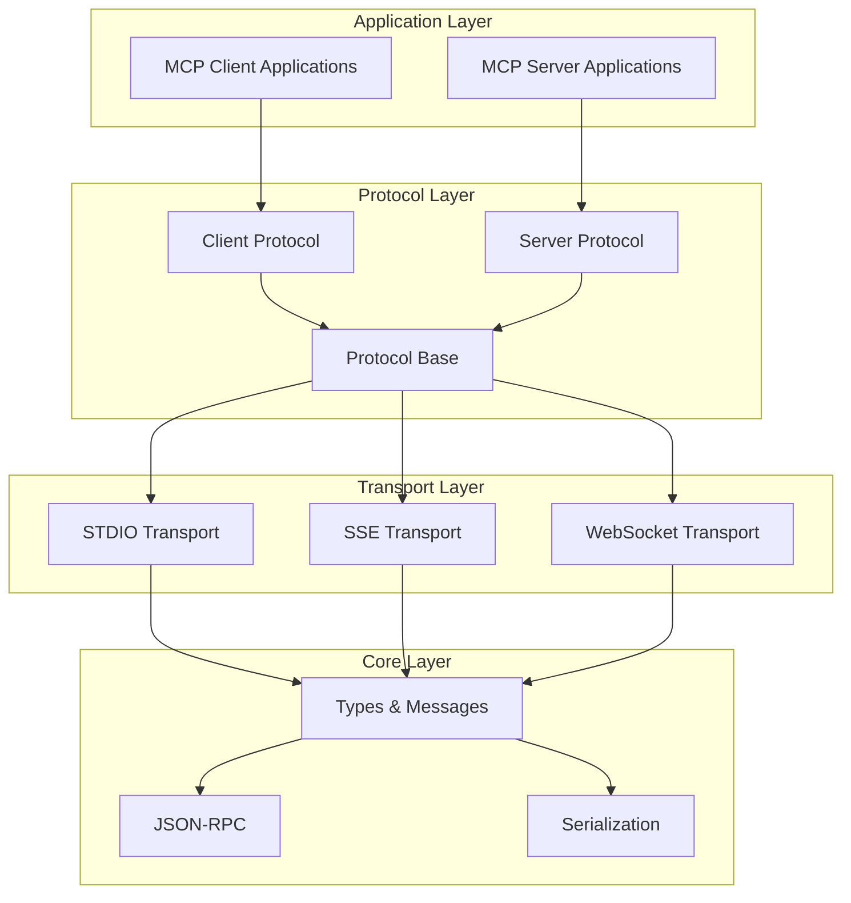
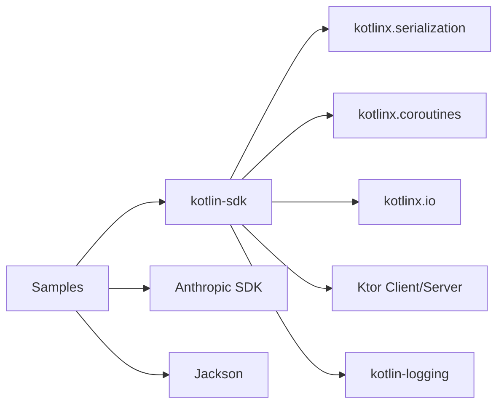

# Kotlin MCP SDK Documentation

## Overview

The Kotlin MCP SDK is a comprehensive implementation of the [Model Context Protocol](https://modelcontextprotocol.io) (MCP) specification, providing both client and server capabilities for integrating with Large Language Model (LLM) surfaces. The SDK enables applications to provide context for LLMs in a standardized way, separating the concerns of providing context from the actual LLM interaction.

## Architecture

The SDK follows a layered architecture with clear separation of concerns:



## Core Components

### 1. Protocol Implementation

#### Base Protocol (`Protocol.kt`)
The abstract `Protocol` class provides the foundation for both client and server implementations:

```kotlin
public abstract class Protocol(
    @PublishedApi internal val options: ProtocolOptions?,
) {
    public var transport: Transport? = null
    
    // Request/response handling
    public suspend fun <T : RequestResult> request(
        request: Request,
        options: RequestOptions? = null,
    ): T
    
    // Notification handling
    public suspend fun notification(notification: Notification)
}
```

Key features:
- Request/response correlation using JSON-RPC message IDs
- Progress notification support
- Capability enforcement
- Error handling and timeout management

#### Client Implementation (`Client.kt`)
The `Client` class extends `Protocol` to provide MCP client functionality:

```kotlin
public open class Client(
    private val clientInfo: Implementation,
    options: ClientOptions = ClientOptions(),
) : Protocol(options) {
    
    public var serverCapabilities: ServerCapabilities? = null
    public var serverVersion: Implementation? = null
    
    // High-level API methods
    public suspend fun listTools(): ListToolsResult?
    public suspend fun callTool(request: CallToolRequest): CallToolResultBase?
    public suspend fun listResources(): ListResourcesResult?
    public suspend fun readResource(request: ReadResourceRequest): ReadResourceResult?
}
```

#### Server Implementation (`Server.kt`)
The `Server` class provides MCP server functionality with automatic request handling:

```kotlin
public open class Server(
    private val serverInfo: Implementation,
    options: ServerOptions,
) : Protocol(options) {
    
    // Registration methods
    public fun addTool(name: String, description: String, handler: suspend (CallToolRequest) -> CallToolResult)
    public fun addPrompt(prompt: Prompt, promptProvider: suspend (GetPromptRequest) -> GetPromptResult)
    public fun addResource(uri: String, name: String, readHandler: suspend (ReadResourceRequest) -> ReadResourceResult)
}
```

### 2. Transport Layer

The SDK supports multiple transport mechanisms:

#### STDIO Transport
- **Client**: `StdioClientTransport` - Communicates via standard input/output streams
- **Server**: `StdioServerTransport` - Handles STDIO communication for servers
- Use case: Command-line tools, subprocess communication

#### SSE (Server-Sent Events) Transport
- **Client**: `SseClientTransport` - Connects to SSE endpoints
- **Server**: `SseServerTransport` - Provides SSE endpoints
- Use case: Web-based applications, real-time updates

#### WebSocket Transport
- **Client**: `WebSocketClientTransport` - WebSocket client implementation
- **Server**: `WebSocketMcpServerTransport` - WebSocket server implementation
- Use case: Real-time bidirectional communication

### 3. Type System

The SDK provides a comprehensive type system (`types.kt`) covering all MCP protocol messages:

#### Core Types
```kotlin
// Base message types
public sealed interface JSONRPCMessage
public data class JSONRPCRequest(val id: RequestId, val method: String, val params: JsonElement)
public data class JSONRPCResponse(val id: RequestId, val result: RequestResult?)
public data class JSONRPCNotification(val method: String, val params: JsonElement)

// Protocol-specific types
public sealed interface Request
public sealed interface Notification
public sealed interface RequestResult
```

#### Capability System
```kotlin
public data class ClientCapabilities(
    val experimental: JsonObject? = EmptyJsonObject,
    val sampling: JsonObject? = EmptyJsonObject,
    val roots: Roots? = null,
)

public data class ServerCapabilities(
    val experimental: JsonObject? = EmptyJsonObject,
    val prompts: Prompts? = null,
    val resources: Resources? = null,
    val tools: Tools? = null,
)
```

### 4. Ktor Integration

The SDK provides seamless integration with Ktor for web-based MCP servers:

#### Server Extensions (`KtorServer.kt`)
```kotlin
// Application-level MCP server
fun Application.mcp(block: () -> Server) {
    install(SSE)
    routing {
        sse("/sse") { /* SSE endpoint */ }
        post("/message") { /* Message handling */ }
    }
}

// Route-level MCP server
fun Routing.mcp(path: String, block: () -> Server)
```

#### WebSocket Extensions (`WebSocketMcpKtorServerExtensions.kt`)
```kotlin
// WebSocket MCP server routes
fun Route.mcpWebSocket(handler: suspend Server.() -> Unit)
fun Route.mcpWebSocket(path: String, handler: suspend Server.() -> Unit)
```

## Sample Applications

### 1. Weather STDIO Server (`weather-stdio-server`)

A complete MCP server implementation providing weather information:

```kotlin
fun `run mcp server`() {
    val server = Server(
        Implementation(name = "weather", version = "1.0.0"),
        ServerOptions(capabilities = ServerCapabilities(tools = ServerCapabilities.Tools(listChanged = true)))
    )
    
    // Weather forecast tool
    server.addTool(
        name = "get_forecast",
        description = "Get weather forecast for a specific latitude/longitude",
        inputSchema = Tool.Input(/* schema definition */)
    ) { request ->
        val latitude = request.arguments["latitude"]?.jsonPrimitive?.doubleOrNull
        val longitude = request.arguments["longitude"]?.jsonPrimitive?.doubleOrNull
        // Implementation...
        CallToolResult(content = forecast.map { TextContent(it) })
    }
}
```

### 2. MCP Client (`kotlin-mcp-client`)

An interactive client that integrates with Anthropic's API:

```kotlin
class MCPClient : AutoCloseable {
    private val anthropic = AnthropicOkHttpClient.fromEnv()
    private val mcp: Client = Client(clientInfo = Implementation(name = "mcp-client-cli", version = "1.0.0"))
    
    suspend fun connectToServer(serverScriptPath: String) {
        val process = ProcessBuilder(command).start()
        val transport = StdioClientTransport(
            input = process.inputStream.asSource().buffered(),
            output = process.outputStream.asSink().buffered()
        )
        mcp.connect(transport)
    }
    
    suspend fun processQuery(query: String): String {
        // Send query to Anthropic with available tools
        // Handle tool calls via MCP
        // Return processed response
    }
}
```

### 3. Kotlin MCP Server (`kotlin-mcp-server`)

A demonstration server with multiple transport options:

```kotlin
fun main(args: Array<String>) {
    when (args.firstOrNull() ?: "--sse-server-ktor") {
        "--stdio" -> runMcpServerUsingStdio()
        "--sse-server-ktor" -> runSseMcpServerUsingKtorPlugin(port)
        "--sse-server" -> runSseMcpServerWithPlainConfiguration(port)
    }
}
```

## Testing Framework

The SDK includes comprehensive testing utilities:

### Transport Testing
- `BaseTransportTest`: Abstract base class for transport testing
- `InMemoryTransport`: In-memory transport for unit testing
- Transport-specific tests for STDIO, SSE, and WebSocket

### Integration Testing
- End-to-end SSE integration tests
- Client-server integration scenarios
- Protocol compliance testing

### Example Test Structure
```kotlin
class ClientTest {
    @Test
    fun `should initialize with matching protocol version`() = runTest {
        val client = Client(clientInfo = Implementation(name = "test client", version = "1.0"))
        // Test implementation...
    }
}
```

## Key Design Patterns

### 1. Protocol Abstraction
The SDK uses abstract base classes to define common protocol behavior while allowing specific implementations for clients and servers.

### 2. Transport Pluggability
Transport implementations are completely pluggable, allowing easy switching between STDIO, SSE, and WebSocket without changing application code.

### 3. Capability-Based Architecture
The protocol enforces capabilities at runtime, ensuring that only supported operations are attempted.

### 4. Coroutine-First Design
All I/O operations are implemented using Kotlin coroutines, providing efficient asynchronous communication.

### 5. Type-Safe Serialization
The SDK uses kotlinx.serialization with polymorphic serializers to handle the complex MCP type hierarchy safely.

## Installation and Setup

### Gradle Configuration

To use the Kotlin MCP SDK in your project, add the following to your `build.gradle.kts`:

```kotlin
repositories {
    mavenCentral()
}

dependencies {
    implementation("io.modelcontextprotocol:kotlin-sdk:0.5.0")
    
    // Optional: For Ktor-based transports (SSE, WebSocket)
    implementation("io.ktor:ktor-server-core:2.3.7")
    implementation("io.ktor:ktor-server-sse:2.3.7")
    implementation("io.ktor:ktor-server-websockets:2.3.7")
    
    // Optional: For client applications using Ktor
    implementation("io.ktor:ktor-client-core:2.3.7")
    implementation("io.ktor:ktor-client-cio:2.3.7")
}
```

For Maven projects, add to your `pom.xml`:

```xml
<dependency>
    <groupId>io.modelcontextprotocol</groupId>
    <artifactId>kotlin-sdk</artifactId>
    <version>0.5.0</version>
</dependency>
```

### Minimum Requirements

- **Kotlin**: 1.9.0 or higher
- **JVM**: Java 11 or higher
- **Gradle**: 7.0 or higher (for Kotlin DSL)
- **Maven**: 3.6.0 or higher

### Project Structure

A typical MCP project structure looks like this:

```
my-mcp-project/
├── build.gradle.kts
├── src/
│   └── main/
│       └── kotlin/
│           ├── client/
│           │   └── MyMcpClient.kt
│           ├── server/
│           │   └── MyMcpServer.kt
│           └── Main.kt
└── README.md
```

## Getting Started Guide

### 1. Basic MCP Server Setup

Create a simple MCP server that provides a calculator tool:

```kotlin
import io.modelcontextprotocol.kotlin.sdk.server.Server
import io.modelcontextprotocol.kotlin.sdk.server.ServerOptions
import io.modelcontextprotocol.kotlin.sdk.server.StdioServerTransport
import io.modelcontextprotocol.kotlin.sdk.Implementation
import io.modelcontextprotocol.kotlin.sdk.ServerCapabilities
import kotlinx.coroutines.runBlocking

fun main() = runBlocking {
    val server = Server(
        serverInfo = Implementation(
            name = "calculator-server",
            version = "1.0.0"
        ),
        options = ServerOptions(
            capabilities = ServerCapabilities(
                tools = ServerCapabilities.Tools(listChanged = true)
            )
        )
    )
    
    // Add calculator tool
    server.addTool(
        name = "calculate",
        description = "Perform basic arithmetic operations"
    ) { request ->
        val operation = request.arguments["operation"]?.jsonPrimitive?.content
        val a = request.arguments["a"]?.jsonPrimitive?.doubleOrNull ?: 0.0
        val b = request.arguments["b"]?.jsonPrimitive?.doubleOrNull ?: 0.0
        
        val result = when (operation) {
            "add" -> a + b
            "subtract" -> a - b
            "multiply" -> a * b
            "divide" -> if (b != 0.0) a / b else Double.NaN
            else -> Double.NaN
        }
        
        CallToolResult(
            content = listOf(TextContent("Result: $result"))
        )
    }
    
    // Connect via STDIO
    val transport = StdioServerTransport()
    server.connect(transport)
}
```

### 2. Basic MCP Client Setup

Create a client that connects to an MCP server:

```kotlin
import io.modelcontextprotocol.kotlin.sdk.client.Client
import io.modelcontextprotocol.kotlin.sdk.client.StdioClientTransport
import io.modelcontextprotocol.kotlin.sdk.Implementation
import kotlinx.coroutines.runBlocking

fun main() = runBlocking {
    val client = Client(
        clientInfo = Implementation(
            name = "calculator-client",
            version = "1.0.0"
        )
    )
    
    // Connect to server process
    val process = ProcessBuilder("java", "-jar", "calculator-server.jar").start()
    val transport = StdioClientTransport(
        input = process.inputStream.asSource().buffered(),
        output = process.outputStream.asSink().buffered()
    )
    
    client.connect(transport)
    
    // List available tools
    val tools = client.listTools()
    println("Available tools: ${tools?.tools?.map { it.name }}")
    
    // Call calculator tool
    val result = client.callTool(
        CallToolRequest(
            name = "calculate",
            arguments = buildJsonObject {
                put("operation", "add")
                put("a", 5.0)
                put("b", 3.0)
            }
        )
    )
    
    println("Calculation result: $result")
}
```

### 3. Web-based MCP Server with Ktor

Create a web server that exposes MCP via SSE:

```kotlin
import io.ktor.server.application.*
import io.ktor.server.engine.*
import io.ktor.server.netty.*
import io.modelcontextprotocol.kotlin.sdk.server.mcp
import io.modelcontextprotocol.kotlin.sdk.server.Server
import io.modelcontextprotocol.kotlin.sdk.server.ServerOptions
import io.modelcontextprotocol.kotlin.sdk.Implementation
import io.modelcontextprotocol.kotlin.sdk.ServerCapabilities

fun main() {
    embeddedServer(Netty, port = 8080) {
        module()
    }.start(wait = true)
}

fun Application.module() {
    mcp {
        Server(
            serverInfo = Implementation(
                name = "web-calculator",
                version = "1.0.0"
            ),
            options = ServerOptions(
                capabilities = ServerCapabilities(
                    tools = ServerCapabilities.Tools(listChanged = true)
                )
            )
        ).apply {
            addTool("calculate", "Web-based calculator") { request ->
                // Tool implementation
                CallToolResult(content = listOf(TextContent("Web calculation complete")))
            }
        }
    }
}
```

## Dependencies

### Core Dependencies
- **kotlinx.serialization**: JSON serialization/deserialization
- **kotlinx.coroutines**: Asynchronous programming
- **kotlinx.io**: I/O operations
- **Ktor**: HTTP client/server functionality (optional)

### Dependency Graph


### Version Compatibility Matrix

| Kotlin SDK | Kotlin | Ktor | kotlinx.serialization | kotlinx.coroutines |
|------------|--------|------|----------------------|-------------------|
| 0.5.0      | 1.9.0+ | 2.3.7+ | 1.6.0+              | 1.7.0+           |
| 0.4.x      | 1.8.0+ | 2.3.0+ | 1.5.0+              | 1.6.0+           |

## Usage Examples

### Basic Client Usage
```kotlin
val client = Client(clientInfo = Implementation(name = "my-client", version = "1.0"))
val transport = StdioClientTransport(inputStream, outputStream)

client.connect(transport)
val tools = client.listTools()
val result = client.callTool("tool-name", mapOf("param" to "value"))
```

### Basic Server Usage
```kotlin
val server = Server(
    serverInfo = Implementation(name = "my-server", version = "1.0"),
    options = ServerOptions(capabilities = ServerCapabilities(tools = ServerCapabilities.Tools()))
)

server.addTool("my-tool", "Description") { request ->
    CallToolResult(content = listOf(TextContent("Response")))
}

val transport = StdioServerTransport(System.`in`.asSource(), System.out.asSink())
server.connect(transport)
```

### Ktor Integration
```kotlin
fun Application.module() {
    mcp {
        Server(
            serverInfo = Implementation(name = "web-server", version = "1.0"),
            options = ServerOptions(capabilities = ServerCapabilities())
        )
    }
}
```

## Error Handling

The SDK provides comprehensive error handling:

- **Protocol Errors**: Capability mismatches, unsupported operations
- **Transport Errors**: Connection failures, timeout handling
- **Serialization Errors**: Invalid message formats, type mismatches
- **Application Errors**: Tool execution failures, resource access errors

## Performance Considerations

- **Streaming**: Large responses are handled efficiently through streaming
- **Connection Pooling**: Ktor-based transports support connection pooling
- **Memory Management**: Careful buffer management in STDIO transports
- **Concurrency**: Full support for concurrent request handling

This documentation provides a comprehensive overview of the Kotlin MCP SDK architecture, components, and usage patterns. The SDK is designed to be both powerful and easy to use, supporting a wide range of MCP integration scenarios.
