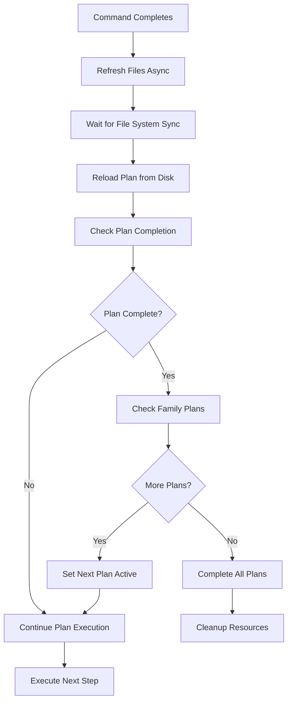

# Auto Continue Plan Feature Timing Fix Analysis


## 🔍 Problem Statement

The auto continue plan feature does not work properly because it fails to recognize when a plan is actually completed. This is due to timing issues where the plan completion check happens before the aider command has finished updating the plan files.

## 🎯 Root Cause Analysis

### 1. **Primary Issue: Disabled Auto-Continue Logic**
**Location**: [`ActivePlanService.kt:44-46`](src/main/kotlin/de/andrena/codingaider/services/plans/ActivePlanService.kt:44)

```kotlin
fun handlePlanActionFinished(success: Boolean = true) {
    return  // TODO: decide whether to use this or not
    // All auto-continue logic is completely disabled!
}
```

**Impact**: The entire auto-continue mechanism is disabled, so plan completion is never checked.

### 2. **Timing Race Condition**
**Location**: [`IDEBasedExecutor.kt:196-242`](src/main/kotlin/de/andrena/codingaider/executors/api/IDEBasedExecutor.kt:196)

**Current Sequence**:
1. `onCommandComplete()` called immediately when aider process exits
2. `refreshFiles()` called → triggers async file system refresh
3. `planExecutionActions.commandCompleted()` called
4. `commandFinishedCallback?.onCommandFinished()` called
5. Plan completion check would happen here (if enabled)

**The Problem**: The plan completion check happens before the file system has been refreshed and before the plan files have been reloaded from disk.

### 3. **File System Refresh Timing**
**Location**: [`FileRefresher.kt`](src/main/kotlin/de/andrena/codingaider/utils/FileRefresher.kt)

The FileRefresher uses multiple levels of async operations:

```kotlin
fun refreshFiles(files: Array<VirtualFile>, markdownDialog: CodingAiderOutputPresentation? = null) {
    invokeLater {  // First async layer
        ApplicationManager.getApplication().invokeLater {  // Second async layer
            WriteAction.runAndWait<Throwable> {
                VirtualFileManager.getInstance().refreshWithoutFileWatcher(false)
                RefreshQueue.getInstance().refresh(true, true, null, *files)
            }
        }
    }
}
```

**The Problem**: The plan completion check happens synchronously while file refresh happens asynchronously, creating a race condition.

### 4. **Plan Reload Timing**
**Location**: [`ActivePlanService.kt:30`](src/main/kotlin/de/andrena/codingaider/services/plans/ActivePlanService.kt:30)

The `refreshActivePlan()` method exists but is never called in the completion flow:

```kotlin
fun refreshActivePlan() {
    activePlan = activePlan?.mainPlanFile?.let { mainFile ->
        project.service<AiderPlanService>().loadPlanFromFile(File(mainFile.filePath))
    }
}
```

**The Problem**: The plan is never reloaded from disk after aider updates it, so the completion check uses stale data.

## 🔧 Proposed Solutions

### **Solution 1: Immediate Fix - Enable and Fix Timing**

**Step 1**: Re-enable the `handlePlanActionFinished()` method in [`ActivePlanService.kt`](src/main/kotlin/de/andrena/codingaider/services/plans/ActivePlanService.kt:44):

```kotlin
fun handlePlanActionFinished(success: Boolean = true) {
    // Remove the early return
    if (!success) {
        cleanupAndClearPlan()
        return
    }
    
    // Add proper timing with delayed execution
    ApplicationManager.getApplication().invokeLater {
        // Wait for file system refresh to complete
        refreshActivePlan()
        checkAndContinuePlan()
    }
}

private fun checkAndContinuePlan() {
    val currentPlan = activePlan ?: return
    
    if (!currentPlan.isPlanComplete()) {
        if (AiderSettings.getInstance().enableAutoPlanContinue) {
            continuePlan()
            return
        }
    }
    
    // Try to find next uncompleted plan in hierarchy
    val nextPlans = currentPlan.getNextUncompletedPlansInSameFamily()
    if (nextPlans.isNotEmpty()) {
        cleanupAndClearPlan() // Cleanup current plan's resources
        setActivePlan(nextPlans.first()) // Set the first uncompleted plan as active

        if (AiderSettings.getInstance().enableAutoPlanContinuationInPlanFamily) {
            continuePlan()
        }
    } else {
        cleanupAndClearPlan()
    }
}
```

**Step 2**: Modify the completion sequence in [`IDEBasedExecutor.kt`](src/main/kotlin/de/andrena/codingaider/executors/api/IDEBasedExecutor.kt:202):

```kotlin
override fun onCommandComplete(message: String, exitCode: Int) {
    updateOutputProgress(message, "Aider Command ${if (exitCode == 0) "Completed" else "Failed"}")
    
    // First refresh files
    refreshFiles()
    
    // Then handle plan execution with proper timing
    ApplicationManager.getApplication().invokeLater {
        planExecutionActions.commandCompleted()
        
        // Add delay to ensure file system operations complete
        Timer().schedule(object : TimerTask() {
            override fun run() {
                ApplicationManager.getApplication().invokeLater {
                    commandFinishedCallback?.onCommandFinished(exitCode == 0)
                }
            }
        }, 500) // 500ms delay
    }
    
    // Continue with rest of the method...
}
```

### **Solution 2: Robust File System Monitoring**

**Create a new service**: `PlanCompletionMonitorService.kt`

```kotlin
@Service(Service.Level.PROJECT)
class PlanCompletionMonitorService(private val project: Project) {
    
    fun monitorPlanCompletion(planId: String, callback: (Boolean) -> Unit) {
        val connection = project.messageBus.connect()
        connection.subscribe(VirtualFileManager.VFS_CHANGES, object : BulkFileListener {
            override fun after(events: List<VFileEvent>) {
                val planFile = File(planId)
                val affectsPlan = events.any { event ->
                    event.path == planFile.absolutePath
                }
                
                if (affectsPlan) {
                    // Plan file was modified, check completion after a short delay
                    Timer().schedule(object : TimerTask() {
                        override fun run() {
                            ApplicationManager.getApplication().invokeLater {
                                val plan = project.service<AiderPlanService>().loadPlanFromFile(planFile)
                                val isComplete = plan?.isPlanComplete() ?: false
                                callback(isComplete)
                                connection.disconnect()
                            }
                        }
                    }, 200)
                }
            }
        })
    }
}
```

### **Solution 3: Reactive Completion Detection**

**Enhance the completion flow** with reactive programming:

```kotlin
fun handlePlanActionFinished(success: Boolean = true): Mono<Void> {
    if (!success) {
        cleanupAndClearPlan()
        return Mono.empty()
    }
    
    return Mono.delay(Duration.ofMillis(500))
        .then(Mono.fromCallable { refreshActivePlan() })
        .then(Mono.fromCallable { 
            val currentPlan = activePlan
            if (currentPlan != null && !currentPlan.isPlanComplete()) {
                if (AiderSettings.getInstance().enableAutoPlanContinue) {
                    continuePlan()
                }
            }
        })
        .subscribeOn(Schedulers.boundedElastic())
        .then()
}
```

## 🏗️ **Robust Plan Completion Detection Mechanism**

### **Design Principles**

1. **Asynchronous-First**: All file operations and plan checks should be async
2. **Retry Logic**: Handle temporary file system inconsistencies
3. **Timeout Protection**: Prevent infinite waiting
4. **State Consistency**: Ensure plan state is always current

### **Implementation Architecture**



## 📋 **Implementation Recommendations**

### **Recommended Approach: Hybrid Solution**

Implement **Solution 1** (Immediate Fix) first for quick resolution, followed by **Solution 2** (File System Monitoring) for long-term robustness.

### **Priority Implementation Steps**

1. **High Priority - Immediate Fix**:
   - Remove the early return in `handlePlanActionFinished()`
   - Add proper timing delays in the completion callback chain
   - Ensure `refreshActivePlan()` is called before completion checks

2. **Medium Priority - Enhanced Timing**:
   - Implement file system monitoring for plan files
   - Add retry logic for plan completion detection
   - Create configurable delay settings

3. **Low Priority - Advanced Features**:
   - Implement reactive completion detection
   - Add comprehensive logging for debugging timing issues
   - Create unit tests for the timing scenarios

### **Configuration Options**

Add these settings to [`AiderSettings.kt`](src/main/kotlin/de/andrena/codingaider/settings/AiderSettings.kt):

```kotlin
var planCompletionCheckDelay: Int = 500  // milliseconds
var planCompletionMaxRetries: Int = 3
var enablePlanCompletionLogging: Boolean = false
```

### **Testing Strategy**

1. **Unit Tests**: Test plan completion detection with mocked file system delays
2. **Integration Tests**: Test with actual aider command execution
3. **Timing Tests**: Verify completion detection works under various timing conditions

## 🎯 **Expected Outcomes**

After implementing these fixes:

1. **Auto continue will work reliably** - Plans will be properly detected as complete
2. **No more false negatives** - Timing issues will be eliminated
3. **Better user experience** - Seamless plan execution flow
4. **Maintainable code** - Clear separation of concerns and proper async handling

## 🔍 **Monitoring and Debugging**

Add comprehensive logging to track the timing flow:

```kotlin
private fun logPlanCompletionFlow(stage: String, planId: String, isComplete: Boolean) {
    if (AiderSettings.getInstance().enablePlanCompletionLogging) {
        logger.info("Plan Completion Flow - Stage: $stage, Plan: $planId, Complete: $isComplete, Timestamp: ${System.currentTimeMillis()}")
    }
}
```

## 📁 **Files Involved**

### **Core Files to Modify**
- `src/main/kotlin/de/andrena/codingaider/services/plans/ActivePlanService.kt`
- `src/main/kotlin/de/andrena/codingaider/executors/api/IDEBasedExecutor.kt`
- `src/main/kotlin/de/andrena/codingaider/settings/AiderSettings.kt`

### **Supporting Files**
- `src/main/kotlin/de/andrena/codingaider/utils/FileRefresher.kt`
- `src/main/kotlin/de/andrena/codingaider/executors/api/CommandPlanExecutionHandler.kt`
- `src/main/kotlin/de/andrena/codingaider/toolwindow/plans/PlansPanel.kt`

### **New Files to Create**
- `src/main/kotlin/de/andrena/codingaider/services/plans/PlanCompletionMonitorService.kt`

## 🚀 **Implementation Priority**

1. **Immediate (High Priority)**: Fix the disabled `handlePlanActionFinished()` method
2. **Short-term (Medium Priority)**: Add proper timing delays and file refresh coordination
3. **Long-term (Low Priority)**: Implement comprehensive file system monitoring and reactive patterns

This analysis reveals that the auto continue plan feature fails primarily due to **disabled functionality** and **timing race conditions**. The solutions proposed address both the immediate issue and provide a robust foundation for reliable plan completion detection.