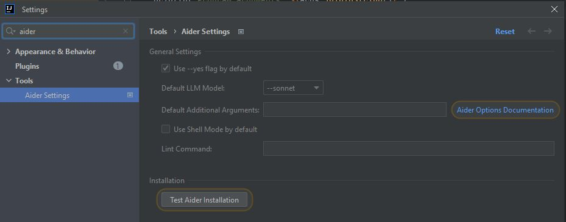

# Coding-Aider Plugin for IntelliJ IDEA 

Seamlessly integrate Aider's AI-powered coding assistance directly into your IDE.
This integration boosts your productivity by offering rapid access for precision code generation and refactoring, all
while allowing you complete control over the context utilized by the LLM.

## Example Usage

## Important Note

To utilize this plugin, you must have a functional Aider installation along with access to API keys for the LLM
Providers you intend to use. Alternatively, you can run a local LLM inference server, such as Ollama, to connect to
Aider.

## Key Features

1. **AI-Powered Coding Assistance**: Harness the power of Aider to receive intelligent coding assistance
   within your IDE.

2. **Intuitive Access**:
    - Quickly initiate Aider actions via the "Start Aider Action" option in the Tools menu or Project View popup menu.
    - Use the keyboard shortcut Alt+A for rapid access.
    - Navigate previous commands with Alt+UP and Alt+DOWN in the message field.
    - Automatically commit all changes with an LLM-generated message using ALT + D

3. **Persistent File Management**: Manage frequently used files for persistent context for Aider operations with
   Alt+Shift+A,
   within the Aider Command Window or the Aider Settings.

4. **Dual Execution Modes**:
    - IDE-based execution for seamless integration.
    - Shell-based execution for users who prefer Aider's rich terminal interaction.

5. **Git Integration**: Automatically launch a Git comparison tool post-Aider operations for easy change review.

6. **Real-time Progress Tracking**: Monitor Aider command progress through Markdown dialog.

7. **Multi-File Support**: Execute Aider actions on multiple files or directories while controlling the context provided
   to Aider from your IDE.

8. **Webcrawl (Experimental)**: Download and convert pages to markdown stored in a .aider-docs folder to add to context.

9. **Various Specialized Actions**:
    - **Commit Action**: Quickly commit changes using Aider.
    - **Document Code Action**: Generate markdown documentation for selected files and directories.
    - **Fix Compile Error Action**: Fix compile errors using Aider's AI capabilities.
    - **Show Last Command Result Action**: Display the result of the last executed Aider command.
    - **Settings Action**: Quickly access Aider Settings.
    - **Apply Design Pattern Action**: Apply predefined design patterns to selected files or directories.
    - **Persistent Files Action**: Manage the list of persistent files for Aider operations.
    - **OpenAiderActionGroup**: Access a popup menu with all available Aider actions.

For a detailed description of all available actions, please refer to the [Actions Documentation](docs/actions.md).

## Advantages Over Other Coding Assistant Plugins

Coding-Aider addresses limitations in existing IntelliJ plugins, particularly for tasks involving multiple file creation
or modification. Aider's unique capabilities include:

1. Optimized token usage for improved speed (featuring replace edit mode, repo-map, and context control).
2. A feature-rich terminal interface for command-line enthusiasts.
3. An extensive range of commands to automate common development tasks.
4. Robust recovery mechanisms with seamless Git integration.

Coding-Aider brings these powerful terminal-based features directly into your IDE, leveraging established IDE
functionalities like Git integration and keyboard shortcuts.

## Getting Started

1. Install Aider-Chat:
    - Visit https://aider.chat/
    - Install as a global pipx Python app
    - Ensure it's accessible from your terminal (`aider --help`)

2. Install the Coding-Aider plugin in a compatible JetBrains IDE.

3. (Recommended) Globally configure API keys for LLM Providers you plan to use (
   see https://aider.chat/docs/config/dotenv.html)

4. Configure Aider settings:
    - Navigate to Tools > Aider Settings
    - Choose between native Aider installation or Docker-based Aider
    - If using native Aider, run the Test to verify your installation
    - If using Docker-based Aider, ensure Docker is installed and running on your system

5. Basic Usage:
    - Select files or directories in your project
    - Use Alt+A or use the entries in the right-click context menu to initiate an Aider action
    - Enter your coding request in the dialog
    - Review Aider's output and resulting changes in your project

6. Advanced Usage:
    - Use Alt+D to automatically commit changes with an LLM-generated message
    - Use Alt+Shift+A to manage persistent files for context
    - Utilize specialized actions like Document Code, Fix Compile Error, or Web Crawl for specific tasks
    - Access the last command result using the Show Last Command Result action
