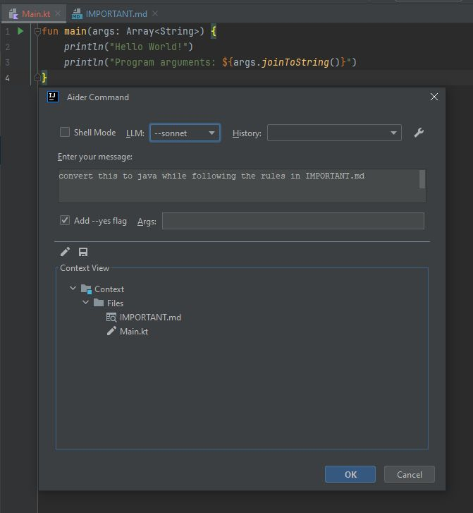

# Coding-Aider Plugin for IntelliJ IDEA 

Coding-Aider is an innovative IntelliJ IDEA plugin that seamlessly integrates Aider's AI-powered coding assistance
directly into your development environment. This integration enhances your productivity by providing intelligent coding
suggestions and automating common development tasks.

## Example Usage

## Key Features

1. **AI-Powered Coding Assistance**: Harness the power of Aider to receive intelligent coding suggestions and assistance
   within your IDE.

2. **Intuitive Access**:
    - Quickly initiate Aider actions via the "Start Aider Action" option in the Tools menu or Project View popup menu.
    - Use the keyboard shortcut Alt+A for rapid access.
    - Navigate previous commands with Alt+UP and Alt+DOWN in the message field.

3. **Persistent File Management**: Efficiently manage frequently used files for Aider operations with Alt+Shift+A.

4. **Dual Execution Modes**:
    - IDE-based execution for seamless integration.
    - Shell-based execution for users who prefer Aider's rich terminal interaction.

5. **Git Integration**: Automatically launch a Git comparison tool post-Aider operations for easy change review.

6. **Real-time Progress Tracking**: Monitor Aider command progress through an interactive Markdown dialog.

7. **Multi-File Support**: Execute Aider actions on multiple files or directories while controlling the context provided
   to Aider from your IDE.

## Advantages Over Other Coding Assistant Plugins

Coding-Aider addresses limitations in existing IntelliJ plugins, particularly for tasks involving multiple file creation
or modification. Aider's unique capabilities include:

1. Optimized token usage for improved speed (featuring replace edit mode, repo-map, and context control).
2. A feature-rich terminal interface for command-line enthusiasts.
3. An extensive range of commands to automate common development tasks.
4. Robust recovery mechanisms with seamless Git integration.

Coding-Aider brings these powerful terminal-based features directly into your IDE, leveraging established IDE
functionalities like Git integration and keyboard shortcuts.

## Getting Started

1. Install Aider-Chat:
    - Visit https://aider.chat/
    - Install as a global pipx Python app
    - Ensure it's accessible from your terminal (`aider --help`)

2. Install the Coding-Aider plugin in IntelliJ IDEA.
3. (Recommended) Globally configure API keys for LLM Providers you plan to use (
   see https://aider.chat/docs/config/dotenv.html)

3. Configure Aider settings:
    - Navigate to Tools > Aider Settings > Run Test to verify your Aider installation.

4. Usage:
    - Select files or directories in your project
    - Use Alt+A or right-click to initiate an Aider action
    - Enter your coding request in the dialog
    - Review Aider's output and resulting changes in your project

