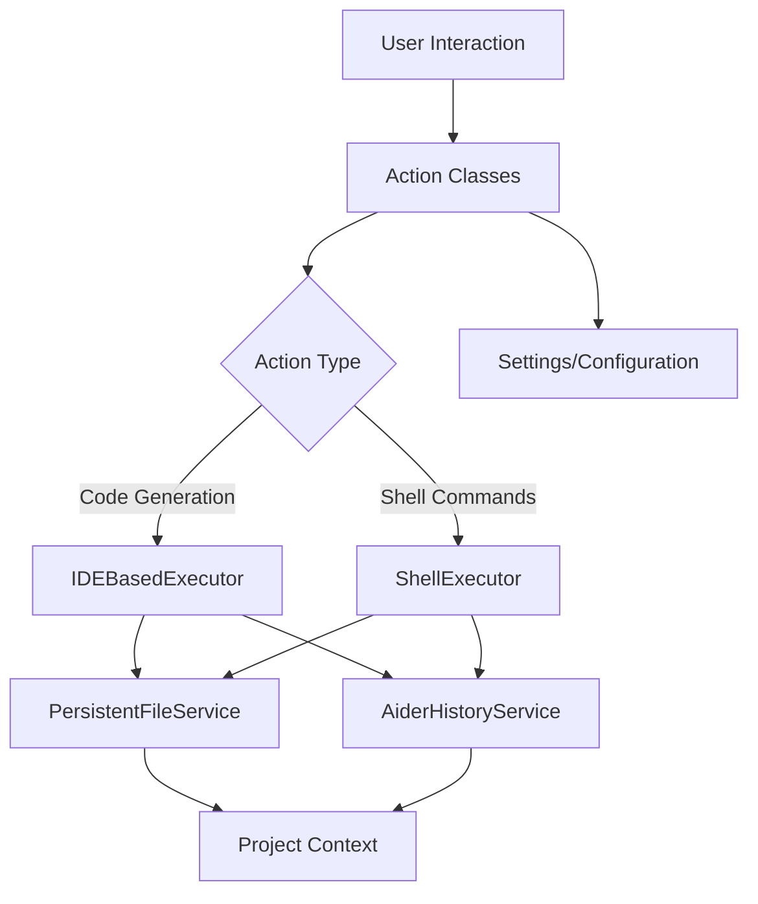

# Aider Actions Module Documentation

## Overview
The Aider Actions module provides a comprehensive set of actions that enhance the functionality of the Aider tool within the IntelliJ IDEA IDE. These actions enable users to perform advanced code management tasks such as:
- Committing code
- Applying design patterns
- Generating documentation
- Managing persistent files
- Fixing compile and build errors
- Web content crawling
- Refactoring to clean code principles

## Module Architecture and Design Patterns

### Architectural Patterns
- **Command Pattern**: Used in action classes to encapsulate and parameterize different actions
- **Facade Pattern**: `OpenAiderActionGroup` provides a simplified interface to multiple complex subsystems
- **Strategy Pattern**: Different executor strategies (`IDEBasedExecutor`, `ShellExecutor`) for action execution

### Key Files and Their Responsibilities

#### 1. [AiderAction.kt](./aider/AiderAction.kt)
- Central action execution mechanism
- Supports both IDE-based and shell mode execution
- Manages command data generation and execution

#### 2. [OpenAiderActionGroup.kt](./aider/OpenAiderActionGroup.kt)
- Creates a dynamic popup menu for quick access to various Aider actions
- Implements a flexible action discovery and presentation mechanism

#### 3. Error Handling Actions
- [FixCompileErrorAction.kt](./aider/FixCompileErrorAction.kt): Intelligent compile error resolution
- [FixBuildAndTestErrorAction.kt](./aider/FixBuildAndTestErrorAction.kt): Comprehensive build and test error fixing

#### 4. Code Improvement Actions
- [DocumentCodeAction.kt](./aider/DocumentCodeAction.kt): Automated code documentation generation
- [DocumentEachFolderAction.kt](./aider/DocumentEachFolderAction.kt): Folder-level documentation
- [RefactorToCleanCodeAction.kt](./aider/RefactorToCleanCodeAction.kt): Code refactoring to clean code principles
- [ApplyDesignPatternAction.kt](./aider/ApplyDesignPatternAction.kt): Design pattern application

#### 5. Utility Actions
- [AiderWebCrawlAction.kt](./aider/AiderWebCrawlAction.kt): Web content crawling and markdown conversion
- [AiderClipboardImageAction.kt](./aider/AiderClipboardImageAction.kt): Clipboard image saving
- [CommitAction.kt](./aider/CommitAction.kt): Version control integration
- [PersistentFilesAction.kt](./ide/PersistentFilesAction.kt): File persistence management

## Dependencies and Interactions

## Exceptional Implementation Details

1. **Dynamic Action Discovery**: `OpenAiderActionGroup` dynamically creates an action menu without hardcoding action lists.

2. **Flexible Execution Strategies**: 
   - Support for both IDE-based and shell mode executions
   - Configurable through settings
   - Adaptable to different project contexts

3. **Error Handling Sophistication**:
   - Intelligent error extraction from various console types
   - Reflection-based error parsing in `FixBuildAndTestErrorAction`

4. **Design Pattern Selection**:
   - YAML-based design pattern metadata
   - Interactive selection with detailed tooltips
   - Context-aware pattern application guidance

## Best Practices and Design Principles

- **Single Responsibility Principle**: Each action class focuses on a specific task
- **Open/Closed Principle**: Easy to extend with new actions without modifying existing code
- **Dependency Injection**: Loose coupling between components
- **Configuration over Convention**: Highly configurable through settings

## Performance and Scalability Considerations

- Lightweight action implementations
- Background thread execution for non-blocking operations
- Minimal runtime overhead
- Extensible architecture for future enhancements

## Security and Compliance

- No direct file system modifications without user consent
- Configurable execution modes
- Integrated with IDE's security model

## Future Roadmap

- Enhanced AI-driven code transformation
- More granular action configurations
- Expanded design pattern and refactoring support

