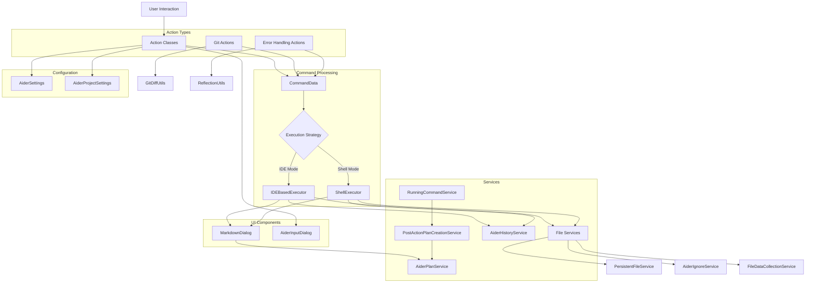

# Aider Actions Module Documentation

## Overview

The Aider Actions module provides a comprehensive set of IntelliJ IDEA actions that integrate with the Aider AI assistant to enhance developer productivity. This module serves as the primary interface between the user and the Aider functionality, offering a wide range of AI-powered code operations through the IDE's action system.

Key capabilities include:
- AI-assisted code generation and modification
- Automated documentation generation
- Code refactoring and pattern application
- Error detection and resolution
- Git integration and code review
- Web content crawling and processing
- Test generation

## Architecture

The Actions module follows a layered architecture with clear separation of concerns:

1. **User Interface Layer**: Action classes that appear in menus and toolbars
2. **Command Layer**: Command data preparation and execution coordination
3. **Execution Layer**: Strategy-based command execution
4. **Service Layer**: Supporting services for file management, settings, and history

### Design Patterns

The module implements several design patterns:

- **Command Pattern**: Each action encapsulates a request as an object ([CommandData](../command/CommandData.kt))
- **Strategy Pattern**: Different execution strategies ([IDEBasedExecutor](../executors/api/IDEBasedExecutor.kt), [ShellExecutor](../executors/api/ShellExecutor.kt))
- **Observer Pattern**: Services notify listeners of state changes
- **Factory Method**: Dialog and UI component creation
- **Facade Pattern**: [OpenAiderActionGroup](./ide/OpenAiderActionGroup.kt) provides a simplified interface
- **Template Method**: Base action classes define algorithms with customizable steps

## Key Components

### Core Actions

#### [AiderAction](./aider/AiderAction.kt)
The primary entry point for Aider functionality. It handles:
- Collection of selected files
- Dialog presentation for user input
- Command data preparation
- Execution mode selection (IDE or Shell)

Key methods:
```kotlin
executeAiderAction(e: AnActionEvent, directShellMode: Boolean)
executeAiderActionWithCommandData(project: Project, commandData: CommandData)
collectCommandData(dialog: AiderInputDialog, project: Project): CommandData
```

#### [OpenAiderActionGroup](./ide/OpenAiderActionGroup.kt)
Provides a popup menu with quick access to all Aider actions. Features:
- Dynamic action discovery and presentation
- Keyboard mnemonics for quick access
- Consistent icon assignment
- Centralized access point for all Aider functionality

### Code Improvement Actions

#### [DocumentCodeAction](./aider/DocumentCodeAction.kt) & [DocumentEachFolderAction](./aider/DocumentEachFolderAction.kt)
Generate comprehensive documentation for code files and project structure:
- Custom documentation file naming
- Concurrent processing for multiple folders
- Mermaid diagram generation for dependencies
- Overview creation with cross-references

#### [RefactorToCleanCodeAction](./aider/RefactorToCleanCodeAction.kt)
Refactors code to follow clean code principles:
- SOLID principles application
- Code simplification (KISS principle)
- Redundancy elimination (DRY principle)
- Naming improvements

#### [ApplyDesignPatternAction](./aider/ApplyDesignPatternAction.kt)
Assists in applying design patterns to existing code:
- Interactive pattern selection with detailed descriptions
- YAML-based pattern metadata
- Context-aware application guidance
- Tooltips and visual aids for pattern understanding

### Error Handling Actions

#### [FixCompileErrorAction](./aider/FixCompileErrorAction.kt)
Detects and fixes compilation errors:
- Intelligent error extraction from IDE's markup model
- Quick fix and interactive modes
- Integration with IDE's intention system

#### [FixBuildAndTestErrorAction](./aider/FixBuildAndTestErrorAction.kt)
Addresses build and test failures:
- Reflection-based error extraction from various console types
- Support for Gradle, Maven, and test runner outputs
- Detailed error context collection

#### [FixTodoAction](./aider/FixTodoAction.kt)
Implements TODO comments in code:
- Automatic TODO detection
- Context-aware implementation suggestions
- Integration with IDE's intention system

### Git Integration

#### [GitCodeReviewAction](./git/GitCodeReviewAction.kt) & [GitLogCodeReviewAction](./git/GitLogCodeReviewAction.kt)
Provide AI-powered code review for Git changes:
- Diff analysis between commits or branches
- Structured review focusing on quality, bugs, performance, and security
- Integration with Git log and VCS tools

#### [CommitAction](./git/CommitAction.kt)
Simplifies Git commit operations:
- Direct commit command execution
- Automatic "Yes" flag for confirmation

### Utility Actions

#### [AiderWebCrawlAction](./aider/AiderWebCrawlAction.kt)
Crawls web content and converts it to markdown:
- HtmlUnit-based web page processing
- Markdown conversion with metadata
- Automatic file management and persistence

#### [AiderClipboardImageAction](./aider/AiderClipboardImageAction.kt) & [AiderClipboardEditFormatAction](./ide/AiderClipboardEditFormatAction.kt)
Handle clipboard content:
- Image saving with unique filenames
- Edit format detection and application
- Automatic file registration

#### [PersistentFilesAction](./ide/PersistentFilesAction.kt) & [AddContextYamlFilesAction](./ide/AddContextYamlFilesAction.kt)
Manage files for persistent context:
- Bulk file addition/removal
- YAML-based context definition
- Dynamic action text based on file state

## Supporting Services and Components

### [MarkdownDialog](../outputview/MarkdownDialog.kt)
Displays Aider output with rich formatting:
- JCEF-based markdown rendering
- Auto-scrolling with user override
- Auto-close with configurable delay
- Plan continuation integration

### [RunningCommandService](../services/RunningCommandService.kt)
Manages active Aider commands:
- Command tracking and history
- Last command storage for plan creation
- Git commit hash tracking for comparisons

### [PostActionPlanCreationService](../services/PostActionPlanCreationService.kt)
Converts command outputs to structured plans:
- XML tag extraction for summaries
- Plan file generation
- Notification handling

## Dependencies Diagram



## Exceptional Implementation Details

### Dynamic Action Discovery and Presentation
The [OpenAiderActionGroup](./ide/OpenAiderActionGroup.kt) implements a sophisticated action discovery mechanism that:
- Dynamically builds the action menu without hardcoding action IDs
- Assigns keyboard mnemonics for quick access (e.g., 'A' for Aider, 'R' for Refactor)
- Provides consistent icons for visual recognition
- Handles action presentation based on context

### Reflection-Based Error Extraction
The [FixBuildAndTestErrorAction](./aider/FixBuildAndTestErrorAction.kt) uses reflection to extract error information from various console types:
```kotlin
private fun extractBuildViewContent(buildView: BuildView): String? {
    // Use reflection to access internal components
    val getComponentMethod = ReflectionUtils.findMethod(buildView::class.java, "getComponent")
    val buildViewComponent = getComponentMethod?.invoke(buildView) as? BuildView ?: return null
    
    // Extract error information from build tree
    val getViewMethod = ReflectionUtils.findMethod(
        buildViewComponent::class.java,
        "getView",
        String::class.java,
        Class::class.java
    )
    // ...
}
```

### Concurrent Documentation Generation
The [DocumentEachFolderAction](./aider/DocumentEachFolderAction.kt) implements a concurrent processing approach:
```kotlin
thread {
    documentationActions.forEach { it.isFinished.await() }
    if (documentationActions.isNotEmpty()) {
        val documentationFiles = documentationActions.map { it.documentationFileData }
        // Create overview markdown file
        // ...
    }
}
```

### Design Pattern Application with Rich Metadata
The [ApplyDesignPatternAction](./aider/ApplyDesignPatternAction.kt) uses YAML-based pattern definitions with rich tooltips:
```kotlin
private fun createTooltipText(pattern: String): String {
    val info = patternsInfo[pattern] ?: return "No information available"
    return """
        <html>
        <b>Description:</b> ${info["description"]}<br><br>
        <b>When to apply:</b> ${info["when_to_apply"]}<br><br>
        <b>What it does:</b> ${info["what_it_does"]}<br><br>
        <b>Benefits:</b> ${info["benefits"]}
        </html>
    """.trimIndent()
}
```

### Auto-Scrolling with User Override in MarkdownDialog
The [MarkdownDialog](../outputview/MarkdownDialog.kt) implements a sophisticated auto-scrolling mechanism that:
- Automatically scrolls to new content
- Detects when users manually scroll away
- Respects user scroll position
- Provides smooth updates without flickering

## Best Practices and Design Principles

The Actions module adheres to several key design principles:

1. **Single Responsibility Principle**: Each action class focuses on a specific task
2. **Open/Closed Principle**: The module is open for extension but closed for modification
3. **Dependency Inversion**: High-level modules depend on abstractions, not concrete implementations
4. **Command-Query Separation**: Methods either perform an action or return information, but not both
5. **Fail-Fast**: Early validation of inputs and preconditions
6. **Progressive Disclosure**: Complex functionality is revealed progressively through the UI

## Performance Considerations

- All actions implement `getActionUpdateThread(): ActionUpdateThread = ActionUpdateThread.BGT` to ensure UI responsiveness
- Long-running operations use background tasks with progress indicators
- Reflection is used sparingly and with proper error handling
- Resource-intensive operations like web crawling implement proper cleanup

## Security and Compliance

- No direct file system modifications without user consent
- Configurable execution modes with clear user feedback
- Integration with IDE's security model for file access
- Proper handling of sensitive information (API keys stored securely)
- Reflection used with appropriate safety checks

## Extension Points

The module provides several extension points for future enhancements:

1. New action types can be added by implementing the AnAction interface
2. Custom execution strategies can be implemented by extending base executor classes
3. Additional dialog types can be created for specialized interactions
4. New error detection and resolution mechanisms can be integrated

## Usage Examples

### Basic Aider Interaction
```kotlin
// User selects files and invokes AiderAction
// AiderInputDialog is shown for user input
// Command is executed with IDEBasedExecutor or ShellExecutor
// Results are displayed in MarkdownDialog
```

### Error Resolution
```kotlin
// User encounters compile error
// FixCompileErrorAction extracts error details
// Aider generates fix based on error context
// Changes are applied to the file
```

### Documentation Generation
```kotlin
// User selects folders to document
// DocumentEachFolderAction processes each folder concurrently
// Documentation files are generated with mermaid diagrams
// Overview document links all individual documents
```

