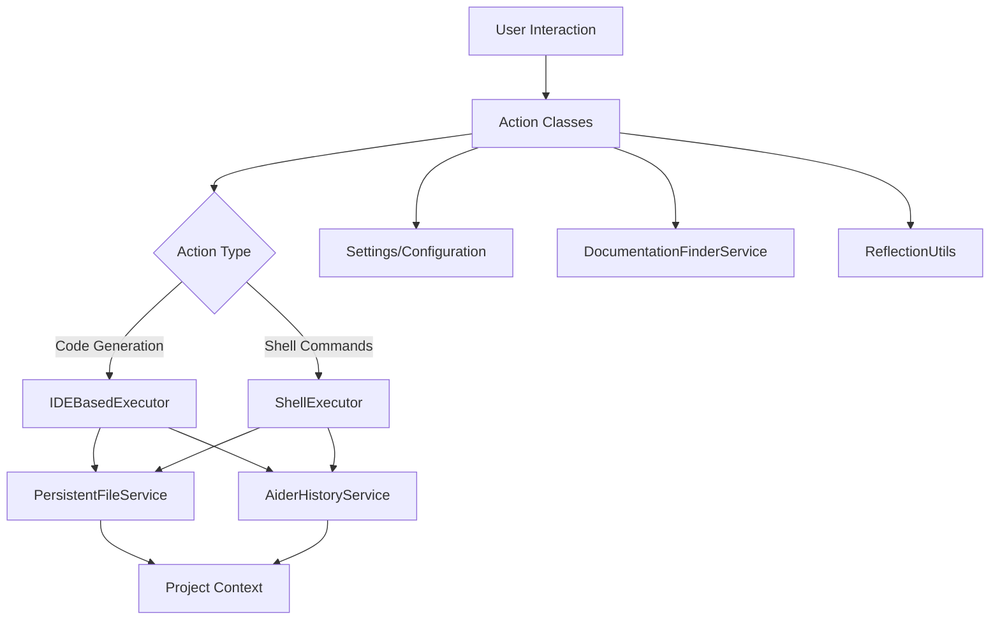

# Aider Actions Module Documentation

## Overview
The Aider Actions module provides a comprehensive set of actions that enhance the functionality of the Aider tool within the IntelliJ IDEA IDE. These actions enable users to perform advanced code management tasks such as:
- Committing code
- Applying design patterns
- Generating documentation
- Managing persistent files
- Fixing compile and build errors
- Web content crawling
- Refactoring to clean code principles

## Module Architecture and Design Patterns

### Architectural Patterns
- **Command Pattern**: Used in action classes to encapsulate and parameterize different actions
- **Facade Pattern**: `OpenAiderActionGroup` provides a simplified interface to multiple complex subsystems
- **Strategy Pattern**: Different executor strategies (`IDEBasedExecutor`, `ShellExecutor`) for action execution

### Key Files and Their Responsibilities

#### 1. [AiderAction.kt](./aider/AiderAction.kt)
- Central action execution mechanism
- Supports both IDE-based and shell mode execution
- Manages command data generation and execution
- Key methods:
  - `executeAiderAction()`: Handles action execution with flexible mode selection
  - `executeAiderActionWithCommandData()`: Allows direct command execution
  - Supports persistent file and documentation file discovery

#### 2. [OpenAiderActionGroup.kt](./aider/OpenAiderActionGroup.kt)
- Creates a dynamic popup menu for quick access to various Aider actions
- Implements a flexible action discovery and presentation mechanism
- Provides keyboard mnemonics and icons for each action
- Dynamically builds action group without hardcoding

#### 3. Error Handling Actions
- [FixCompileErrorAction.kt](./aider/FixCompileErrorAction.kt): 
  - Intelligent compile error resolution
  - Supports both interactive and quick fix modes
  - Detects compile errors using IDE's markup model
- [FixBuildAndTestErrorAction.kt](./aider/FixBuildAndTestErrorAction.kt): 
  - Comprehensive build and test error fixing
  - Uses reflection to extract errors from various console types
  - Provides interactive and automatic error resolution

#### 4. Code Improvement Actions
- [DocumentCodeAction.kt](./aider/DocumentCodeAction.kt): 
  - Automated code documentation generation
  - Allows custom documentation filename
  - Supports whole-file editing
- [DocumentEachFolderAction.kt](./aider/DocumentEachFolderAction.kt): 
  - Generates documentation for each folder
  - Creates an overview markdown with module dependencies
  - Uses concurrent processing for multiple folders
- [RefactorToCleanCodeAction.kt](./aider/RefactorToCleanCodeAction.kt): 
  - Refactors code to adhere to clean code and SOLID principles
  - Provides detailed refactoring instructions
- [ApplyDesignPatternAction.kt](./aider/ApplyDesignPatternAction.kt): 
  - Interactive design pattern selection
  - YAML-based design pattern metadata
  - Provides tooltips and context for pattern application

#### 5. Utility Actions
- [AiderWebCrawlAction.kt](./aider/AiderWebCrawlAction.kt): 
  - Web content crawling and markdown conversion
  - Uses HtmlUnit and Flexmark for HTML to markdown processing
  - Generates unique filenames with content hash
- [AiderClipboardImageAction.kt](./aider/AiderClipboardImageAction.kt): 
  - Clipboard image saving
  - Generates unique image filenames
  - Automatically adds images to persistent files
- [CommitAction.kt](./aider/CommitAction.kt): 
  - Simplified version control integration
  - Executes "/commit" command with "Yes" flag
- [PersistentFilesAction.kt](./ide/PersistentFilesAction.kt): 
  - Manages persistent files
  - Supports bulk file addition/removal
  - Dynamic action text based on file state

## Dependencies and Interactions

## Exceptional Implementation Details

1. **Dynamic Action Discovery**: 
   - `OpenAiderActionGroup` creates action menu without hardcoding
   - Supports keyboard mnemonics and dynamic icon assignment

2. **Flexible Execution Strategies**: 
   - Supports IDE-based and shell mode executions
   - Configurable through settings
   - Adaptable to different project contexts

3. **Advanced Error Handling**:
   - Intelligent error extraction from various console types
   - Reflection-based error parsing in `FixBuildAndTestErrorAction`
   - Supports multiple error sources (build, test, compile)

4. **Design Pattern and Refactoring Support**:
   - YAML-based design pattern metadata
   - Interactive selection with detailed tooltips
   - Context-aware pattern application guidance
   - Clean code principle adherence

## Best Practices and Design Principles

- **Single Responsibility Principle**: Each action class focuses on a specific task
- **Open/Closed Principle**: Easy to extend with new actions
- **Dependency Injection**: Loose coupling between components
- **Configuration over Convention**: Highly configurable through settings

## Performance and Scalability Considerations

- Lightweight action implementations
- Background thread execution (`ActionUpdateThread.BGT`)
- Minimal runtime overhead
- Concurrent processing in multi-folder actions
- Extensible architecture for future enhancements

## Security and Compliance

- No direct file system modifications without user consent
- Configurable execution modes
- Integrated with IDE's security model
- Uses reflection with caution and safety checks

## Future Roadmap

- Enhanced AI-driven code transformation
- More granular action configurations
- Expanded design pattern and refactoring support
- Improved error detection and resolution
- Enhanced documentation generation capabilities

