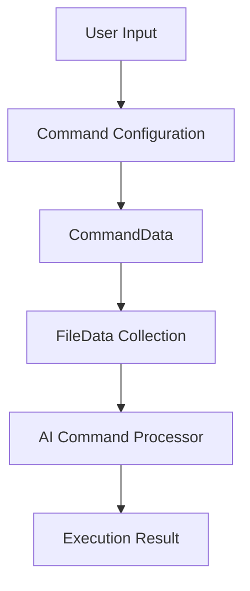

# Command Module Documentation

## Overview
The Command module provides a robust and flexible data structure for managing command execution within the Coding Aider application. It encapsulates complex command configurations, supporting various scenarios of code interaction and AI-assisted development.

## Architecture and Design Patterns

### Design Principles
- **Data Transfer Object (DTO) Pattern**: Utilizes lightweight data classes to transfer command configuration between application components.
- **Immutability**: Leverages Kotlin's `data class` for immutable, thread-safe configuration objects.
- **Flexible Configuration**: Supports extensive customization through optional parameters and flags.

## Key Components

### FileData
A lightweight data class representing file metadata for command processing.

```kotlin
data class FileData(
    val filePath: String,     // Absolute or relative path to the file
    val isReadOnly: Boolean   // Indicates file modification permissions
)
```

#### Key Features
- Tracks individual file properties
- Supports read-only file handling
- Used in multi-file command scenarios

### CommandData
Comprehensive configuration for executing Aider commands with extensive customization options.

```kotlin
data class CommandData(
    val message: String,          // Primary instruction/message
    val useYesFlag: Boolean,      // Automatic prompt confirmation
    val llm: String,               // Specified language model
    val additionalArgs: String,   // Extra command-line arguments
    val files: List<FileData>,     // Files involved in the command
    val isShellMode: Boolean,      // Shell interaction mode
    val lintCmd: String,           // Linting command
    val projectPath: String,       // Project root directory
    val options: CommandOptions    // Advanced configuration options
)
```

#### Advanced Configuration Options
- Language model selection
- Shell mode toggling
- Linting integration
- Multi-file command support

### CommandOptions
Provides granular control over command execution and presentation.

```kotlin
data class CommandOptions(
    val disablePresentation: Boolean = false,   // Suppress change visualization
    val useDockerAider: Boolean? = null,        // Docker container preference
    val commitHashToCompareWith: String? = null,// Git comparison reference
    val autoCloseDelay: Int? = null             // Markdown dialog auto-close timing
)
```

## Data Flow Visualization



## Exceptional Implementation Details
- Supports structured and unstructured command modes
- Flexible LLM model specification
- Optional Docker container execution
- Git change comparison capabilities

## Module Dependencies
- Kotlin Standard Library
- Aider Application Framework

## Potential Use Cases
1. AI-assisted code refactoring
2. Multi-file code generation
3. Automated code review and linting
4. Flexible development workflow management

## Related Files
- [FileData.kt](./FileData.kt)
- [CommandData.kt](./CommandData.kt)

## Best Practices
- Use immutable configuration objects
- Leverage optional parameters for flexibility
- Prefer composition over complex inheritance
