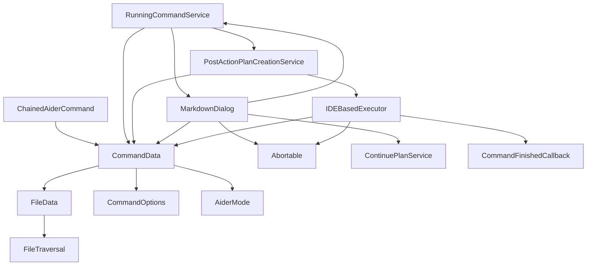

# Command Module Documentation

## Overview

The Command Module is responsible for handling the execution of Aider commands within the CodingAider plugin. It provides the data structures and services necessary for creating, executing, and managing commands that interact with AI models to assist with coding tasks.

## Key Components

### Data Structures

#### [CommandData](CommandData.kt)

`CommandData` is the core data structure that represents an Aider command to be executed. It encapsulates all the information needed to run a command, including:

- The message or instruction for the AI
- Configuration options for the language model
- Files to be included in the context
- Command execution options
- Mode settings (normal, shell, or structured)

```kotlin
data class CommandData(
    val message: String,
    val useYesFlag: Boolean,
    val llm: String,
    val additionalArgs: String,
    val files: List<FileData>,
    val lintCmd: String,
    val deactivateRepoMap: Boolean = false,
    val editFormat: String = "",
    val projectPath: String,
    val options: CommandOptions = CommandOptions.DEFAULT,
    val aiderMode: AiderMode = AiderMode.NORMAL,
    val sidecarMode: Boolean = false,
    val planId: String? = null
)
```

#### [CommandOptions](CommandData.kt)

`CommandOptions` provides additional configuration for command execution:

```kotlin
data class CommandOptions(
    val disablePresentation: Boolean = false,
    val useDockerAider: Boolean? = null,
    val commitHashToCompareWith: String? = null,
    val autoCloseDelay: Int? = null,
    val autoCommit: Boolean? = null,
    val dirtyCommits: Boolean? = null,
    val promptAugmentation: Boolean? = null,
)
```

#### [FileData](CommandData.kt)

`FileData` represents a file to be included in the command context:

```kotlin
data class FileData(val filePath: String, val isReadOnly: Boolean)
```

#### [ChainedAiderCommand](CommandData.kt)

`ChainedAiderCommand` enables multi-step command execution where the output of one command can be used as input for the next:

```kotlin
data class ChainedAiderCommand(
    val commandData: CommandData,
    val transformOutputToInput: ((String) -> String)? = null
)
```

### Services

#### [RunningCommandService](../services/RunningCommandService.kt)

This service manages the currently running commands and stores information about the last completed command:

- Tracks active command dialogs
- Stores the last completed command and its output
- Manages Git commit hashes for command execution
- Provides functionality to create plans from completed commands

#### [PostActionPlanCreationService](../services/PostActionPlanCreationService.kt)

This service is responsible for creating structured plans from completed Aider commands:

- Extracts summaries from command outputs
- Creates new plan creation commands
- Handles plan creation failures with appropriate notifications

### UI Components

#### [MarkdownDialog](../outputview/MarkdownDialog.kt)

`MarkdownDialog` is the primary UI component for displaying command outputs:

- Renders markdown content from command execution
- Provides controls for aborting commands
- Supports auto-scrolling and auto-closing
- Includes buttons for creating plans from command outputs
- Enables continuation of structured plans

## Workflow

1. A `CommandData` object is created with the necessary parameters
2. The command is executed using an `IDEBasedExecutor`
3. Output is displayed in a `MarkdownDialog`
4. The `RunningCommandService` tracks the command execution
5. After completion, the command can be used to create a plan via `PostActionPlanCreationService`

## Dependencies



## Implementation Details

### Command Execution

Commands are executed asynchronously, with progress updates displayed in the `MarkdownDialog`. The dialog provides real-time feedback and allows users to abort long-running commands.

### Plan Creation

After a command completes, users can convert the command and its output into a structured plan. This is particularly useful for complex features that require multiple steps to implement.

### Auto-continuation

For structured mode commands, the system can automatically continue plan execution after a step completes, creating a seamless workflow for multi-step tasks.

### Git Integration

The system tracks Git commit hashes before and after command execution, enabling comparison of changes made by the command.
