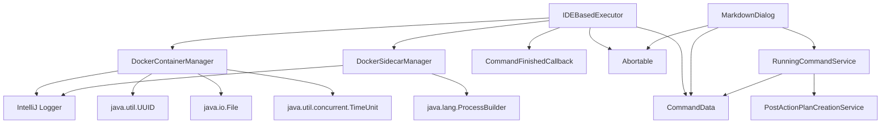

# Docker Module Documentation

## Overview
The Docker module provides container management capabilities for the Coding Aider plugin, enabling seamless integration with Docker containers for various operations. This module handles container lifecycle management, including creation, tracking, and termination, with robust error handling and resource cleanup.

## Key Components

### Container Management Classes
- **[DockerContainerManager](./DockerContainerManager.kt)**: Manages ephemeral Docker containers with unique identifiers
- **[DockerSidecarManager](./DockerSidecarManager.kt)**: Handles long-running sidecar containers with persistent names

## Architecture and Design

### Class Responsibilities

#### DockerContainerManager
- Generates unique container identifiers using UUID
- Tracks container IDs via temporary files in system temp directory
- Provides robust container termination with timeout handling
- Implements comprehensive error logging and cleanup procedures

#### DockerSidecarManager
- Manages named containers with persistent identifiers
- Provides container status checking capabilities
- Handles graceful container stopping and removal
- Implements error-resilient container management

### Dependency Diagram

## Key Methods and Interfaces

### DockerContainerManager
- `getCidFilePath()`: Returns the absolute path to the container ID file
- `getDockerContainerId()`: Retrieves the Docker container ID with retry mechanism
- `stopDockerContainer()`: Gracefully stops the Docker container with timeout handling
- `removeCidFile()`: Cleans up temporary container ID files

### DockerSidecarManager
- `stopDockerContainer()`: Stops and removes the named sidecar container
- `isContainerRunning()`: Checks if the sidecar container is currently running

## Exceptional Implementation Details

### Container ID Retrieval
- Implements a robust retry mechanism (up to 10 attempts)
- Uses 500ms sleep intervals between attempts
- Handles potential race conditions in container ID file generation

### Container Termination
- Uses Docker CLI for container stopping
- Implements a 5-second timeout for stop operations
- Forcibly destroys processes exceeding timeout
- Ensures cleanup of temporary files even in failure scenarios

### Error Handling
- Comprehensive logging of all critical operations
- Captures and logs exceptions during container management
- Provides visibility into container lifecycle events
- Graceful degradation in case of Docker CLI failures

## Integration with Other Modules

### Command Execution
The Docker module integrates with the command execution framework through:
- **[CommandData](../command/CommandData.kt)**: Contains Docker-specific options for command execution
- **[IDEBasedExecutor](../executors/api/IDEBasedExecutor.kt)**: Uses Docker containers for command execution

### User Interface
- **[MarkdownDialog](../outputview/MarkdownDialog.kt)**: Displays Docker command outputs and provides abort capabilities

### Services
- **[RunningCommandService](../services/RunningCommandService.kt)**: Tracks running Docker commands
- **[PostActionPlanCreationService](../services/PostActionPlanCreationService.kt)**: Creates plans from Docker command outputs

## Security and Performance Considerations
- Uses system temporary directory for CID files
- Generates unique file names to prevent conflicts
- Implements proper resource cleanup to avoid container leaks
- Handles Docker CLI errors gracefully
- Provides timeout mechanisms to prevent hanging processes

## Use Cases
- Running AI model inference in isolated containers
- Executing code analysis tools in containerized environments
- Supporting sidecar mode for persistent AI assistants
- Providing isolated environments for code generation and testing

## Related Files
- [DockerContainerManager.kt](./DockerContainerManager.kt)
- [DockerSidecarManager.kt](./DockerSidecarManager.kt)
- [CommandData.kt](../command/CommandData.kt)
- [MarkdownDialog.kt](../outputview/MarkdownDialog.kt)
- [RunningCommandService.kt](../services/RunningCommandService.kt)
- [PostActionPlanCreationService.kt](../services/PostActionPlanCreationService.kt)

