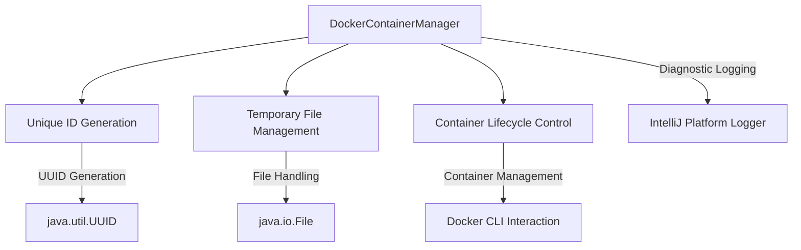

# Docker Container Management Module

## Overview
The `DockerContainerManager` is a specialized utility for managing Docker container lifecycles within the application, focusing on robust container ID tracking and controlled container termination.

## Key Features
- Unique container ID generation using UUID
- Temporary file-based container ID tracking
- Safe and controlled Docker container stopping mechanism
- Comprehensive error logging and diagnostic capabilities

## Architecture and Design

### Class Responsibilities
- **DockerContainerManager**: Manages Docker container lifecycle
  - Generates unique container identifiers
  - Tracks container IDs via temporary files
  - Provides methods for container termination
  - Implements robust error handling and logging

### Architectural Diagram

### Key Methods
- `getCidFilePath()`: Retrieves the absolute path of the container ID file
- `getDockerContainerId()`: Retrieves the Docker container ID with retry mechanism
- `stopDockerContainer()`: Gracefully stops the Docker container
- `removeCidFile()`: Cleans up the temporary container ID file

## Exceptional Implementation Details
- **Container ID Retrieval**:
  - Implements a robust retry mechanism (up to 10 attempts)
  - Uses 500ms sleep intervals between attempts
  - Handles potential race conditions in container ID file generation

- **Container Termination**:
  - Uses Docker CLI for container stopping
  - Implements a 5-second timeout for stop operations
  - Forcibly destroys processes exceeding timeout
  - Ensures cleanup of temporary files

- **Error Handling**:
  - Comprehensive logging of all critical operations
  - Captures and logs exceptions during container management
  - Provides visibility into container lifecycle events

## Dependencies
- **External Libraries**:
  - IntelliJ Platform Logger
  - Java File and Concurrency APIs
  - Docker CLI

## Security and Performance Considerations
- Uses system temporary directory for CID files
- Generates unique file names to prevent conflicts
- Minimal overhead with lightweight file-based tracking
- Short-lived file and process management
- Non-blocking container stop mechanism

## Use Cases
- Automated testing environments
- CI/CD pipeline container management
- Ephemeral container orchestration scenarios

## Related Files
- [DockerContainerManager.kt](./DockerContainerManager.kt)

## Licensing
Proprietary code - Andrena Solutions

