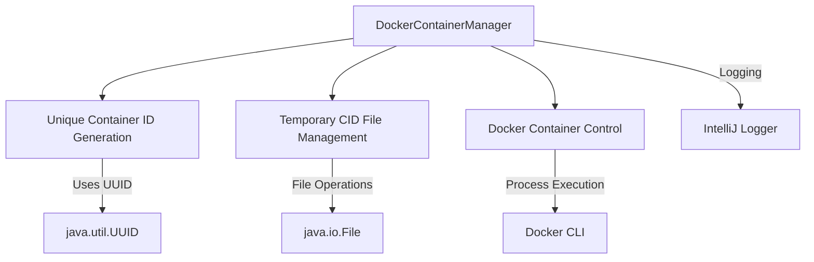

# Docker Container Management Module

## Overview
The `DockerContainerManager` is a specialized utility for managing Docker container lifecycles within the application, focusing on robust container ID tracking and controlled container termination.

## Key Features
- Unique container ID generation
- Temporary file-based container ID tracking
- Safe container stopping mechanism
- Comprehensive error logging

## Architecture Diagram

## Class: DockerContainerManager
### Key Methods
- `getCidFilePath()`: Retrieves the absolute path of the container ID file
- `stopDockerContainer()`: Gracefully stops the Docker container
- `removeCidFile()`: Cleans up the temporary container ID file

### Exceptional Implementation Details
- Implements a retry mechanism (up to 10 attempts) for reading container ID
- Uses a 5-second timeout for container stop operations
- Forcibly destroys processes that exceed timeout
- Comprehensive logging for all critical operations

## Dependencies
- IntelliJ Platform Logger
- Java File and Concurrency APIs
- Docker CLI

## Error Handling Strategy
- Catches and logs exceptions during container management
- Ensures cleanup operations even in failure scenarios
- Provides visibility into container lifecycle events

## Potential Use Cases
- Automated testing environments
- CI/CD pipeline container management
- Ephemeral container orchestration

## Security Considerations
- Uses system temporary directory for CID files
- Generates unique file names to prevent conflicts
- Implements file cleanup to minimize residual artifacts

## Performance Notes
- Minimal overhead with lightweight file-based tracking
- Short-lived file and process management
- Non-blocking container stop mechanism

## Related Files
- [DockerContainerManager.kt](./DockerContainerManager.kt)

## Licensing
Proprietary code - Andrena Solutions

