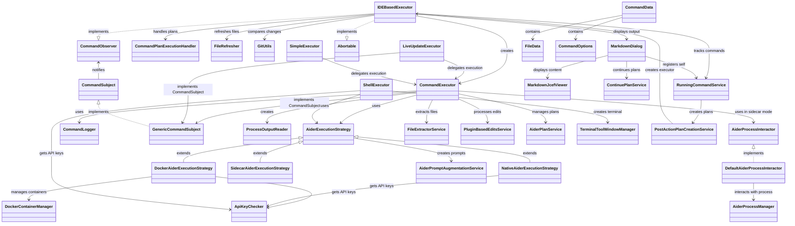

# Aider Executors Module Documentation

## Overview
The Aider Executors module is responsible for executing commands related to the Aider application. It provides a flexible architecture for running AI-assisted code editing commands through various execution strategies, including native execution, Docker-based execution, and sidecar mode. The module handles command construction, environment preparation, process management, output processing, and user interface integration.

## Key Components

### Command Execution Core

#### [CommandExecutor](./CommandExecutor.kt)
- **Purpose**: Central component that orchestrates command execution based on the provided `CommandData`.
- **Key Methods**:
  - `executeCommand()`: Builds and executes the command, handling output and process completion.
  - `abortCommand()`: Aborts the currently running command.
- **Features**:
  - Supports both standard and sidecar execution modes
  - Handles file extraction before execution
  - Manages process lifecycle and output collection
  - Integrates with plugin-based edit processing

#### [ProcessOutputReader](./ProcessOutputReader.kt)
- **Purpose**: Reads and processes output from command execution processes.
- **Key Methods**:
  - `start()`: Begins reading from process output streams.
- **Features**:
  - Handles both stdout and stderr streams
  - Provides real-time output updates to observers
  - Supports graceful abort handling

### Execution Strategies

#### [AiderExecutionStrategy](./strategies/AiderExecutionStrategy.kt)
- **Purpose**: Abstract base class defining the interface for execution strategies.
- **Key Methods**:
  - `buildCommand()`: Builds the command based on the provided `CommandData`.
  - `prepareEnvironment()`: Prepares the execution environment.
  - `cleanupAfterExecution()`: Cleans up after command execution.
- **Features**:
  - Provides common command argument building logic
  - Handles model selection and configuration
  - Supports reasoning effort configuration

#### [DockerAiderExecutionStrategy](./strategies/DockerAiderExecutionStrategy.kt)
- **Purpose**: Executes commands within a Docker container.
- **Key Features**:
  - Mounts project files into the container
  - Configures environment variables for API keys
  - Handles provider-specific Docker configurations
  - Supports network configuration for local models

#### [NativeAiderExecutionStrategy](./strategies/NativeAiderExecutionStrategy.kt)
- **Purpose**: Executes commands directly on the host system.
- **Key Features**:
  - Sets up environment variables for API keys
  - Configures provider-specific environment variables
  - Handles custom model configurations

#### [SidecarAiderExecutionStrategy](./strategies/SidecarAiderExecutionStrategy.kt)
- **Purpose**: Provides an execution strategy for long-lived Aider sidecar processes.
- **Key Features**:
  - Builds commands with sidecar mode configuration
  - Minimal environment preparation
  - Delegates cleanup to AiderProcessManager

### Executor Variants

#### [IDEBasedExecutor](./api/IDEBasedExecutor.kt)
- **Purpose**: Manages the execution of commands within the IDE, providing a user interface for command output.
- **Key Methods**:
  - `execute()`: Initializes the command execution and displays the output in a dialog.
  - `abortCommand()`: Aborts the command execution and updates the dialog.
- **Features**:
  - Integrates with Git for change comparison
  - Handles file refreshing after command execution
  - Manages plan execution actions
  - Provides auto-close functionality

#### [ShellExecutor](./api/ShellExecutor.kt)
- **Purpose**: Executes commands in a terminal shell environment.
- **Key Methods**:
  - `execute()`: Prepares the environment and executes the command in a terminal session.
- **Features**:
  - Integrates with the IDE's terminal window
  - Sets up environment variables for API keys
  - Supports both native and Docker execution strategies

#### [LiveUpdateExecutor](./api/LiveUpdateExecutor.kt)
- **Purpose**: Executes commands and provides real-time updates to observers.
- **Key Methods**:
  - `execute()`: Executes the command and notifies observers of the progress.
- **Features**:
  - Implements the observer pattern for real-time updates
  - Delegates to CommandExecutor for actual execution

#### [SimpleExecutor](./api/SimpleExecutor.kt)
- **Purpose**: A lightweight executor that directly executes commands using `CommandExecutor`.
- **Key Methods**:
  - `execute()`: Executes the command and returns the output.
- **Features**:
  - Provides a simple interface for command execution
  - Useful for programmatic command execution without UI

### Observer Pattern Implementation

#### [CommandObserver](./api/CommandObserver.kt)
- **Purpose**: Interface defining callbacks for command execution events.
- **Key Methods**:
  - `onCommandStart()`: Called when a command starts.
  - `onCommandProgress()`: Called with command progress updates.
  - `onCommandComplete()`: Called when a command completes.
  - `onCommandError()`: Called when a command encounters an error.

#### [CommandSubject](./api/CommandObserver.kt)
- **Purpose**: Interface for objects that can be observed during command execution.
- **Key Methods**:
  - `addObserver()`: Adds an observer to the subject.
  - `removeObserver()`: Removes an observer from the subject.
  - `notifyObservers()`: Notifies all observers of an event.

#### [GenericCommandSubject](./GenericCommandSubject.kt)
- **Purpose**: Standard implementation of the CommandSubject interface.
- **Key Methods**:
  - `addObserver()`: Adds an observer to the collection.
  - `removeObserver()`: Removes an observer from the collection.
  - `notifyObservers()`: Notifies all registered observers.

### Utility Classes

#### [CommandLogger](./CommandLogger.kt)
- **Purpose**: Logs command execution details.
- **Key Methods**:
  - `getCommandString()`: Returns a string representation of the command being executed.
  - `prependCommandToOutput()`: Prepends the command string to the output.
- **Features**:
  - Supports verbose command logging
  - Formats commands for readability

#### [CommandFinishedCallback](./api/CommandFinishedCallback.kt)
- **Purpose**: Functional interface for command completion callbacks.
- **Key Methods**:
  - `onCommandFinished()`: Called when a command finishes execution.

#### [CommandPlanExecutionHandler](./api/CommandPlanExecutionHandler.kt)
- **Purpose**: Manages plan-related actions before and after command execution.
- **Key Methods**:
  - `beforeCommandStarted()`: Performs setup actions before command execution.
  - `commandCompleted()`: Handles plan-related actions after command completion.
- **Features**:
  - Tracks plan files before and after execution
  - Sets active plans based on command data

### Process Interaction

#### [AiderProcessInteractor](./api/AiderProcessInteractor.kt)
- **Purpose**: Interface for interacting with Aider processes.
- **Key Methods**:
  - `sendCommandSync()`: Sends a command and waits for the response.
  - `sendCommandAsync()`: Sends a command and returns a reactive stream of responses.
  - `isReadyForCommand()`: Checks if the process is ready to receive commands.

#### [DefaultAiderProcessInteractor](./api/AiderProcessInteractor.kt)
- **Purpose**: Default implementation of AiderProcessInteractor.
- **Features**:
  - Integrates with AiderProcessManager
  - Provides both synchronous and asynchronous command execution

### UI Components

#### [MarkdownDialog](../outputview/MarkdownDialog.kt)
- **Purpose**: Displays command output in a markdown-formatted dialog.
- **Key Features**:
  - Real-time output updates
  - Auto-scrolling
  - Auto-close functionality
  - Plan continuation support
  - Plan creation support
  - Abort command functionality

### Supporting Services

#### [PostActionPlanCreationService](../services/PostActionPlanCreationService.kt)
- **Purpose**: Creates plans from completed Aider commands.
- **Key Methods**:
  - `createPlanFromCommand()`: Converts command output into a structured plan.
- **Features**:
  - Extracts summaries from command output
  - Creates follow-up tasks based on completed actions

#### [RunningCommandService](../services/RunningCommandService.kt)
- **Purpose**: Tracks running and completed commands.
- **Key Methods**:
  - `addRunningCommand()`: Adds a command to the running commands list.
  - `removeRunningCommand()`: Removes a command from the running commands list.
  - `storeCompletedCommand()`: Stores information about a completed command.
  - `createPlanFromLastCommand()`: Creates a plan from the last completed command.
- **Features**:
  - Maintains a list of running commands
  - Stores information about the last completed command
  - Tracks Git commit hashes before and after command execution

### Data Models

#### [CommandData](../command/CommandData.kt)
- **Purpose**: Represents the data required to execute an Aider command.
- **Key Properties**:
  - `message`: The main instruction for Aider.
  - `files`: List of files to be included in the command.
  - `llm`: The language model to be used.
  - `aiderMode`: The mode to use for the command (NORMAL, STRUCTURED, ARCHITECT, etc.).
  - `options`: Contains optional parameters for the command.
- **Features**:
  - Supports various execution modes
  - Configurable command options
  - File tracking with read-only status

## Design Patterns

### Strategy Pattern
The module uses the Strategy pattern to define different execution strategies:
- `AiderExecutionStrategy` defines the interface
- `DockerAiderExecutionStrategy`, `NativeAiderExecutionStrategy`, and `SidecarAiderExecutionStrategy` provide concrete implementations
- `CommandExecutor` selects the appropriate strategy based on configuration

### Observer Pattern
The module implements the Observer pattern for command execution events:
- `CommandSubject` defines the observable interface
- `CommandObserver` defines the observer interface
- `GenericCommandSubject` provides a standard implementation
- Various executors implement `CommandObserver` to receive updates

### Factory Method Pattern
The module uses factory methods to create appropriate execution strategies:
- `CommandExecutor` creates the appropriate strategy based on configuration
- `IDEBasedExecutor` creates CommandExecutor instances

### Facade Pattern
Several classes act as facades to simplify complex subsystems:
- `IDEBasedExecutor` provides a simplified interface for command execution with UI integration
- `SimpleExecutor` provides a minimal interface for direct command execution

## Data Flow

1. **Command Initialization**:
   - A client creates a `CommandData` object with the necessary parameters
   - The client selects an appropriate executor (IDEBasedExecutor, ShellExecutor, etc.)

2. **Execution Strategy Selection**:
   - The executor creates a `CommandExecutor` instance
   - `CommandExecutor` selects the appropriate `AiderExecutionStrategy` based on configuration

3. **Command Execution**:
   - The strategy builds the command and prepares the environment
   - `CommandExecutor` starts the process and begins reading output
   - `ProcessOutputReader` reads output from the process and notifies observers

4. **Result Processing**:
   - Observers receive updates about command progress and completion
   - `IDEBasedExecutor` updates the UI with command output
   - After completion, files are refreshed and Git comparison tools may be opened

5. **Post-Execution Actions**:
   - `CommandPlanExecutionHandler` performs plan-related actions
   - `RunningCommandService` stores information about the completed command
   - Optional plan creation or continuation may occur

## Class Dependency Diagram

## Key Implementation Details

1. **Sidecar Mode**:
   - Allows maintaining a long-running Aider process for faster command execution
   - Reduces startup overhead for multiple commands
   - Managed by AiderProcessManager and SidecarProcessInitializer

2. **Plugin-Based Edits**:
   - Enables processing of LLM responses directly within the plugin
   - Allows for more sophisticated edit handling than standard Aider edits
   - Controlled by the `pluginBasedEdits` setting

3. **Plan Integration**:
   - Commands can create, update, and continue structured plans
   - Plan files are tracked before and after command execution
   - Supports automatic plan continuation

4. **Docker Integration**:
   - Provides isolated execution environment
   - Handles complex container configuration
   - Supports various LLM providers with provider-specific settings

5. **Multi-Provider Support**:
   - Supports various LLM providers (OpenAI, Ollama, Vertex AI, etc.)
   - Configures environment variables based on provider requirements
   - Handles authentication for different provider types

6. **Real-Time Output Processing**:
   - Provides immediate feedback during command execution
   - Supports auto-scrolling with user override
   - Handles large outputs efficiently

## Important Links

- [CommandExecutor.kt](./CommandExecutor.kt)
- [ProcessOutputReader.kt](./ProcessOutputReader.kt)
- [CommandLogger.kt](./CommandLogger.kt)
- [GenericCommandSubject.kt](./GenericCommandSubject.kt)
- [AiderExecutionStrategy.kt](./strategies/AiderExecutionStrategy.kt)
- [DockerAiderExecutionStrategy.kt](./strategies/DockerAiderExecutionStrategy.kt)
- [NativeAiderExecutionStrategy.kt](./strategies/NativeAiderExecutionStrategy.kt)
- [SidecarAiderExecutionStrategy.kt](./strategies/SidecarAiderExecutionStrategy.kt)
- [IDEBasedExecutor.kt](./api/IDEBasedExecutor.kt)
- [ShellExecutor.kt](./api/ShellExecutor.kt)
- [LiveUpdateExecutor.kt](./api/LiveUpdateExecutor.kt)
- [SimpleExecutor.kt](./api/SimpleExecutor.kt)
- [CommandObserver.kt](./api/CommandObserver.kt)
- [CommandFinishedCallback.kt](./api/CommandFinishedCallback.kt)
- [CommandPlanExecutionHandler.kt](./api/CommandPlanExecutionHandler.kt)
- [AiderProcessInteractor.kt](./api/AiderProcessInteractor.kt)
