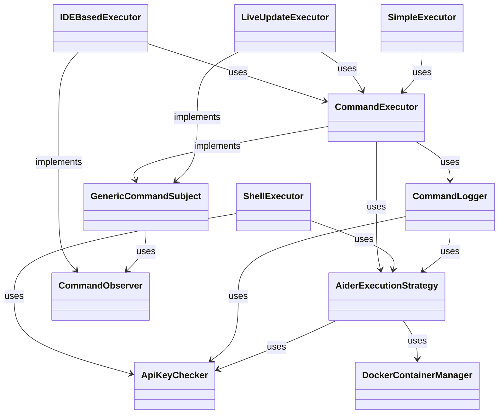

# Aider Executors Module Documentation

## Overview
The Aider Executors module is responsible for executing commands related to the Aider application. It provides various execution strategies, including native execution and Docker-based execution. The module also handles command logging and observer patterns to notify other components about command execution status.

## Key Classes and Interfaces

### CommandExecutor
- **Purpose**: Executes commands based on the provided `CommandData`.
- **Key Methods**:
  - `executeCommand()`: Builds and executes the command, handling output and process completion.
  - `abortCommand()`: Aborts the currently running command.
- **File**: [CommandExecutor.kt](./CommandExecutor.kt)

### ShellExecutor
- **Purpose**: Executes commands in a shell environment.
- **Key Methods**:
  - `execute()`: Prepares the environment and executes the command in a terminal session.
- **File**: [ShellExecutor.kt](./api/ShellExecutor.kt)

### IDEBasedExecutor
- **Purpose**: Manages the execution of commands within the IDE, providing a user interface for command output.
- **Key Methods**:
  - `execute()`: Initializes the command execution and displays the output in a dialog.
  - `abortCommand()`: Aborts the command execution and updates the dialog.
- **File**: [IDEBasedExecutor.kt](./api/IDEBasedExecutor.kt)

### LiveUpdateExecutor
- **Purpose**: Executes commands and notifies observers about the execution status.
- **Key Methods**:
  - `execute()`: Executes the command and notifies observers of the progress.
- **File**: [LiveUpdateExecutor.kt](./api/LiveUpdateExecutor.kt)

### SimpleExecutor
- **Purpose**: A simple executor that directly executes commands using `CommandExecutor`.
- **Key Methods**:
  - `execute()`: Executes the command and returns the output.
- **File**: [SimpleExecutor.kt](./api/SimpleExecutor.kt)

### CommandLogger
- **Purpose**: Logs command execution details.
- **Key Methods**:
  - `getCommandString()`: Returns a string representation of the command being executed.
  - `prependCommandToOutput()`: Prepends the command string to the output.
- **File**: [CommandLogger.kt](./CommandLogger.kt)

### GenericCommandSubject
- **Purpose**: Implements the observer pattern for command execution.
- **Key Methods**:
  - `addObserver()`: Adds an observer to the subject.
  - `notifyObservers()`: Notifies all observers of an event.
- **File**: [GenericCommandSubject.kt](./GenericCommandSubject.kt)

### AiderExecutionStrategy
- **Purpose**: Abstract class for defining execution strategies.
- **Key Methods**:
  - `buildCommand()`: Builds the command based on the provided `CommandData`.
  - `prepareEnvironment()`: Prepares the execution environment.
  - `cleanupAfterExecution()`: Cleans up after command execution.
- **File**: [AiderExecutionStrategy.kt](./AiderExecutionStrategy.kt)

### SidecarAiderExecutionStrategy
- **Purpose**: Provides an execution strategy for long-lived Aider sidecar processes.
- **Key Methods**:
  - `buildCommand()`: Builds the command with sidecar mode flag.
  - `prepareEnvironment()`: Minimal environment preparation.
  - `cleanupAfterExecution()`: Delegates cleanup to AiderProcessManager.
- **File**: [SidecarAiderExecutionStrategy.kt](./SidecarAiderExecutionStrategy.kt)

## Design Patterns
- **Observer Pattern**: Used in `GenericCommandSubject` to notify observers about command execution events.
- **Strategy Pattern**: Used in `AiderExecutionStrategy` to define different execution strategies (native and Docker).

## Dependencies
- The module depends on the following:
  - `CommandData`: Represents the data required to execute a command.
  - `ApiKeyChecker`: Used to manage API keys for command execution.
  - `DockerContainerManager`: Manages Docker containers for execution.

## Data Flow
1. The `IDEBasedExecutor` initiates command execution by creating an instance of `CommandExecutor`.
2. The `CommandExecutor` builds the command using the `AiderExecutionStrategy`.
3. The command is executed, and observers are notified of the progress and completion.
4. The `CommandLogger` logs the command details for reference.

## Class Dependency Diagram

## Important Links
- [CommandExecutor.kt](./CommandExecutor.kt)
- [ShellExecutor.kt](./api/ShellExecutor.kt)
- [IDEBasedExecutor.kt](./api/IDEBasedExecutor.kt)
- [LiveUpdateExecutor.kt](./api/LiveUpdateExecutor.kt)
- [SimpleExecutor.kt](./api/SimpleExecutor.kt)
- [CommandLogger.kt](./CommandLogger.kt)
- [GenericCommandSubject.kt](./GenericCommandSubject.kt)
- [AiderExecutionStrategy.kt](./AiderExecutionStrategy.kt)
