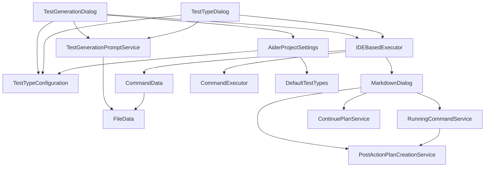

# Coding Aider Features Documentation

## Test Generation

The test generation feature allows users to automatically generate test code for selected files using AI-powered templates.

### Overview

The test generation module provides a framework for generating different types of tests (unit tests, integration tests, BDD specifications, etc.) based on configurable templates. Users can select files, choose a test type, and optionally provide additional instructions to customize the generated tests.

### Key Components

#### Test Type Configuration

[TestTypeConfiguration](testgeneration/TestTypeConfiguration.kt) defines the structure for test templates:

- **Name**: Identifies the test type (e.g., "Unit Test")
- **Prompt Template**: The AI prompt used to generate the test
- **Reference File Pattern**: Regex pattern to identify existing test files of this type
- **Test File Pattern**: Pattern for naming generated test files
- **Context Files**: Reference files that provide examples of testing patterns
- **Enabled/Disabled**: Toggle for availability in the UI

#### Default Test Types

[DefaultTestTypes](testgeneration/DefaultTestTypes.kt) provides predefined test configurations:

- **Unit Tests**: Following given/when/then pattern with edge cases
- **Integration Tests**: Focusing on component interactions
- **BDD Specifications**: Using descriptive feature/scenario language

#### Dialog Components

- [TestGenerationDialog](testgeneration/dialogs/TestGenerationDialog.kt): Main dialog for selecting test types and providing additional instructions
- [TestTypeDialog](testgeneration/dialogs/TestTypeDialog.kt): Dialog for creating/editing test type configurations

#### Prompt Generation

[TestGenerationPromptService](testgeneration/TestGenerationPromptService.kt) builds prompts for the AI model by:

1. Combining selected files information
2. Including references to existing test files matching the pattern
3. Adding configured context files
4. Incorporating the test type's prompt template
5. Adding any user-provided additional instructions

### Implementation Details

- **Path Handling**: The system handles both absolute and relative paths for context files, automatically converting between them as needed
- **Test Pattern Analysis**: The system can analyze existing test files to extract testing patterns and conventions
- **IDE Integration**: Seamless integration with IntelliJ's file selection and project structure

### Workflow

1. User selects files to generate tests for
2. User chooses a test type from configured templates
3. User optionally adds specific instructions
4. System builds a prompt combining all information
5. AI generates test code based on the prompt
6. Results are displayed in a markdown dialog

### Supporting Components

#### Markdown Dialog

[MarkdownDialog](../outputview/MarkdownDialog.kt) provides a rich display for AI-generated content with features:

- Auto-scrolling with user override detection
- Auto-close with configurable delay
- Plan creation from command output
- Continue plan functionality

#### Command Data

[CommandData](../command/CommandData.kt) encapsulates all information needed for an Aider command:

- Message content
- Selected files
- LLM configuration
- Additional arguments
- Mode settings (normal, shell, structured)

#### Running Command Service

[RunningCommandService](../services/RunningCommandService.kt) manages active commands and stores completed command information for:

- Tracking running dialogs
- Storing last completed command for plan creation
- Managing Git commit hashes for comparison

#### Plan Creation

[PostActionPlanCreationService](../services/PostActionPlanCreationService.kt) converts completed commands into structured plans:

- Extracts summaries from command output
- Creates plan files in the designated folder
- Builds follow-up tasks based on completed work

### Class Dependencies

### Integration Points

- **Settings System**: Test types are stored in project settings
- **Command Execution**: Uses the common command execution framework
- **Plan System**: Can create structured plans from test generation commands
- **File System**: Integrates with IDE's file selection and VFS

### Future Enhancements

Potential areas for improvement:

- Support for more test frameworks and languages
- Test coverage analysis integration
- Test result feedback loop
