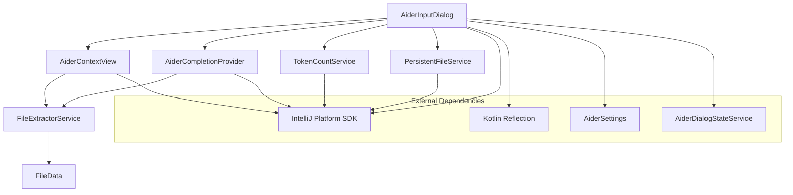

# Aider Input Dialog Module Documentation

## Overview
The Aider Input Dialog module provides a sophisticated, context-aware interface for AI-assisted code development within the IntelliJ IDEA environment. It enables developers to interact with AI language models, manage project files, and generate code suggestions with enhanced usability.

## System Architecture



## Key Components

### AiderInputDialog
- **Purpose**: Central user interaction point for AI-assisted coding
- **Key Features**:
  - Dynamic language model selection
  - Command history navigation
  - Token count tracking
  - Flexible input modes (shell, structured)
  - Persistent file management

#### Notable Methods
- `createCenterPanel()`: Constructs the complex, multi-component dialog UI
- `getInputText()`: Retrieves user's command input
- `getAllFiles()`: Retrieves current context files
- `restoreLastState()`: Restores previous dialog configuration

### AiderContextView
- **Purpose**: Manage and visualize project file context
- **Key Features**:
  - Tree-based file representation
  - File status tracking (read-only, persistent)
  - Dynamic file addition/removal
  - Token count calculation for context

#### Notable Methods
- `selectedFilesChanged()`: Updates file context view
- `toggleReadOnlyMode()`: Modify file interaction permissions
- `addOpenFilesToContext()`: Include currently open files

### AiderCompletionProvider
- **Purpose**: Intelligent code completion and suggestion
- **Key Features**:
  - Dynamic extraction of class and method information
  - Context-aware completion suggestions
  - Supports multiple programming language elements

#### Notable Methods
- `getItems()`: Generate context-specific completion suggestions
- `extractCompletions()`: Parse project files for completion data

## Design Patterns
- **Model-View-Controller (MVC)**
- **Lazy Initialization** (via `LazyCacheDelegate`)
- **Strategy Pattern** (for API key and LLM selection)
- **Decorator Pattern** (for file status management)
- **Observer Pattern** (for UI updates and event handling)

## Exceptional Implementation Details
- Advanced token counting mechanism using lazy evaluation
- Dynamic file extraction and management with persistent file tracking
- Intelligent code completion with multi-language support
- Flexible input modes (normal, shell, structured)
- Comprehensive error handling and API key validation
- Customizable UI with dynamic action groups and toolbars

## Dependencies
- IntelliJ Platform SDK
- Kotlin Reflection
- Custom Services:
  - `TokenCountService`
  - `FileExtractorService`
  - `PersistentFileService`
  - `AiderDialogStateService`
  - `AiderHistoryService`

## Configuration and Extensibility
- Supports multiple language models
- Configurable through IDE settings
- Extensible completion and file management strategies
- Supports custom API key providers
- Configurable token counting strategies

## Links to Key Files
- [AiderInputDialog.kt](./AiderInputDialog.kt)
- [AiderContextView.kt](./AiderContextView.kt)
- [AiderCompletionProvider.kt](./AiderCompletionProvider.kt)

## Usage Scenarios
1. Code generation with context-aware suggestions
2. File management during AI-assisted development
3. Tracking and managing development context
4. Flexible command input for various development tasks
5. Persistent file tracking across IDE sessions

## Performance Considerations
- Lazy token counting
- Efficient file parsing
- Minimal overhead in IDE interaction
- Background thread for API key validation
- Caching of file extraction results

## Security and Privacy
- Secure API key management
- Optional persistent file tracking
- Configurable read-only modes
- Support for multiple authentication methods

## Future Improvements
- Enhanced multi-language support
- More granular token counting
- Advanced file diff and merge capabilities
- Machine learning-based context understanding
```
