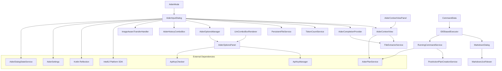

# Aider Input Dialog Module Documentation

## Overview
The Aider Input Dialog module provides a sophisticated, context-aware interface for AI-assisted code development within the IntelliJ IDEA environment. It enables developers to interact with AI language models, manage project files, and generate code suggestions with enhanced usability. The module serves as the primary user interface for the Coding Aider plugin, allowing developers to communicate with AI models and manage the context of their code-related queries.

## System Architecture

## Key Components

### [AiderInputDialog](./AiderInputDialog.kt)
- **Purpose**: Central user interaction point for AI-assisted coding
- **Key Features**:
  - Dynamic language model selection
  - Command history navigation
  - Token count tracking
  - Flexible input modes (normal, shell, structured, architect)
  - Persistent file management
  - Image paste handling
  - Context copying to clipboard

#### Notable Methods
- `createCenterPanel()`: Constructs the complex, multi-component dialog UI
- `getInputText()`: Retrieves user's command input
- `getAllFiles()`: Retrieves current context files
- `restoreLastState()`: Restores previous dialog configuration
- `copyContextToClipboard()`: Copies all context files and prompt to clipboard

### [AiderContextView](./AiderContextView.kt)
- **Purpose**: Manage and visualize project file context
- **Key Features**:
  - Tree-based file representation
  - File status tracking (read-only, persistent)
  - Dynamic file addition/removal
  - Token count calculation for context
  - Integration with .aiderignore file system

#### Notable Methods
- `selectedFilesChanged()`: Updates file context view
- `toggleReadOnlyMode()`: Modify file interaction permissions
- `addOpenFilesToContext()`: Include currently open files
- `addPlanContextFilesToContext()`: Add files referenced in active plans
- `isFileIgnored()`: Check if a file is ignored by .aiderignore

### [AiderCompletionProvider](./AiderCompletionProvider.kt)
- **Purpose**: Intelligent code completion and suggestion
- **Key Features**:
  - Dynamic extraction of class and method information
  - Context-aware completion suggestions
  - Supports multiple programming language elements
  - Intelligent parsing of project structure

#### Notable Methods
- `getItems()`: Generate context-specific completion suggestions
- `extractCompletions()`: Parse project files for completion data
- `extractFromPsiFile()`: Extract class and method information from PSI files
- `findMethodLikeElements()`: Identify method-like elements in code

### [LlmComboBoxRenderer](./LlmComboBoxRenderer.kt)
- **Purpose**: Custom renderer for the language model selection combo box
- **Key Features**:
  - Displays API key status for each language model
  - Provides tooltips with detailed API key information
  - Background validation of API keys

#### Notable Methods
- `getListCellRendererComponent()`: Customizes the rendering of each item in the combo box

### [AiderHistory](./AiderHistory.kt) and [AiderHistoryComboBox](./AiderHistory.kt)
- **Purpose**: Manages and displays command history
- **Key Features**:
  - Navigates through command history
  - Displays command details with timestamps
  - Persistent storage of command history

#### Notable Methods
- `navigateHistory()`: Navigates through the command history
- `loadHistory()`: Loads history from persistent storage

### [AiderContextViewPanel](./AiderContextViewPanel.kt)
- **Purpose**: Provides a toolbar and panel for managing file context
- **Key Features**:
  - Toolbar actions for adding, removing, and toggling file status
  - File context view integration
  - .aiderignore file management

#### Notable Methods
- `createFileActionGroup()`: Creates actions for adding files to context
- `createFileStatusActionGroup()`: Creates actions for toggling file status
- `manageAiderIgnore()`: Opens the .aiderignore file for editing
- `addSelectedFilesToAiderIgnore()`: Adds selected files to .aiderignore

### [ImageAwareTransferHandler](./ImageAwareTransferHandler.kt)
- **Purpose**: Handles image paste and drag-and-drop operations
- **Key Features**:
  - Detects image data in clipboard
  - Supports drag-and-drop of image files
  - Visual feedback during drag operations

#### Notable Methods
- `importData()`: Handles the import of image data
- `canImport()`: Determines if the data can be imported

### [MarkdownDialog](./MarkdownDialog.kt)
- **Purpose**: Displays AI responses and command output
- **Key Features**:
  - Markdown rendering with syntax highlighting
  - Auto-scrolling with user override
  - Auto-close timer with keep-open option
  - Plan continuation support
  - Plan creation from command output

#### Notable Methods
- `updateProgress()`: Updates the dialog content with new output
- `setProcessFinished()`: Marks the process as complete and updates UI
- `startAutoCloseTimer()`: Starts the auto-close countdown

### [AiderMode](./AiderMode.kt)
- **Purpose**: Defines the different operational modes for Aider
- **Key Features**:
  - Normal mode for standard AI assistance
  - Shell mode for executing shell commands
  - Structured mode for plan-based development
  - Architect mode for complex design problems

### [CommandData](./CommandData.kt)
- **Purpose**: Encapsulates all data needed for an Aider command
- **Key Features**:
  - Message content
  - LLM selection
  - File context
  - Command options
  - Mode settings

### [RunningCommandService](./RunningCommandService.kt)
- **Purpose**: Manages currently running Aider commands
- **Key Features**:
  - Tracks active command dialogs
  - Stores last command output
  - Supports plan creation from completed commands
  - Tracks Git commit hashes for changes

### [PostActionPlanCreationService](./PostActionPlanCreationService.kt)
- **Purpose**: Creates structured plans from completed commands
- **Key Features**:
  - Extracts summaries from command output
  - Generates follow-up tasks
  - Creates plan files in the .coding-aider-plans directory

## Design Patterns
- **Model-View-Controller (MVC)**: Separation of UI components from data and logic
- **Lazy Initialization** (via `LazyCacheDelegate`): Deferred computation of expensive operations
- **Strategy Pattern**: For API key and LLM selection handling
- **Decorator Pattern**: For file status management and UI component enhancement
- **Observer Pattern**: For UI updates and event handling across components
- **Command Pattern**: For encapsulating command execution details
- **Factory Pattern**: For creating UI components and dialog elements

## Exceptional Implementation Details
- **Advanced Token Counting**: Uses lazy evaluation to efficiently count tokens in large files
- **Image Handling**: Sophisticated clipboard and drag-drop support for images
- **Multi-Mode Operation**: Seamless switching between different operational modes
- **Plan Integration**: Deep integration with the planning system for structured development
- **Context Management**: Comprehensive file context management with persistent storage
- **API Key Security**: Secure handling of API keys with validation
- **Intelligent Completion**: Context-aware code completion using PSI parsing
- **Markdown Rendering**: High-performance markdown rendering with JCEF browser
- **Auto-Scroll Logic**: Smart auto-scrolling that respects user interaction
- **History Navigation**: Keyboard shortcuts for efficient history navigation

## Dependencies
- **IntelliJ Platform SDK**: For UI components and PSI parsing
- **Kotlin Reflection**: For dynamic component handling
- **Custom Services**:
  - `TokenCountService`: For efficient token counting
  - `FileExtractorService`: For file content extraction
  - `PersistentFileService`: For persistent file storage
  - `AiderDialogStateService`: For dialog state persistence
  - `AiderHistoryService`: For command history management
  - `AiderIgnoreService`: For .aiderignore file management
  - `AiderPlanService`: For plan management and integration
  - `ApiKeyManager`: For secure API key storage
  - `ApiKeyChecker`: For API key validation

## Configuration and Extensibility
- **Multiple LLM Support**: Configurable language model selection
- **Custom API Key Providers**: Extensible API key management
- **Configurable UI**: Collapsible panels and customizable components
- **Persistent Settings**: User preferences stored across sessions
- **Extensible File Handling**: Pluggable file extraction and filtering

## Usage Scenarios
1. **Code Generation**: Request AI to generate code based on requirements
2. **Code Explanation**: Ask AI to explain complex code sections
3. **Refactoring Assistance**: Get AI help with code refactoring
4. **Structured Development**: Create and follow plans for feature implementation
5. **Documentation Generation**: Generate documentation for existing code
6. **Shell Command Execution**: Run shell commands with AI assistance
7. **Architecture Design**: Get help with high-level design decisions

## Performance Considerations
- **Lazy Token Counting**: Only count tokens when needed
- **Background Processing**: Heavy operations run in background threads
- **Efficient File Parsing**: Smart caching of file parsing results
- **UI Responsiveness**: Non-blocking UI updates
- **Memory Management**: Careful handling of large file contents

## Security and Privacy
- **Secure API Key Storage**: Keys stored in system credential store
- **Configurable File Inclusion**: Control which files are sent to AI
- **Read-Only Mode**: Protect sensitive files from modification
- **.aiderignore Support**: Systematically exclude files from AI context
- **Multiple Authentication Methods**: Support for various API authentication approaches

## Future Improvements
- **Enhanced Multi-Language Support**: Better handling of diverse programming languages
- **More Granular Token Counting**: Language-specific token counting
- **Advanced File Diff and Merge**: Improved handling of code changes
- **Machine Learning-Based Context Understanding**: Smarter context selection
- **Expanded Image Support**: Better handling of diagrams and screenshots
- **Team Collaboration Features**: Sharing contexts and AI sessions
