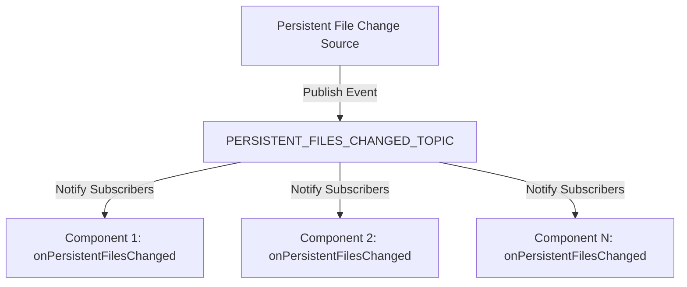

# Messages Module Documentation

## Overview
The Messages module provides a flexible, event-driven mechanism for handling persistent file changes within the IntelliJ Platform plugin. It implements a publish-subscribe pattern to enable loose coupling between components that need to react to file modifications.

## Key Components

### Interface: PersistentFilesChangedTopic
- **File**: [`PersistentFilesChangedTopic.kt`](./PersistentFilesChangedTopic.kt)
- **Purpose**: Define a contract for handling persistent file change events
- **Key Method**: `onPersistentFilesChanged()`
  - Triggered when persistent files are modified
  - Allows components to define custom behavior in response to file changes

### Companion Object
- **PERSISTENT_FILES_CHANGED_TOPIC**
  - Static topic reference for publishing and subscribing to file change events
  - Uses IntelliJ Platform's `Topic.create()` method

## Design Patterns
- **Observer Pattern**: Enables event-driven communication
- **Publish-Subscribe Pattern**: Decouples event producers from event consumers

## Architecture Diagram


## Dependencies
- IntelliJ Platform Messaging System
  - `com.intellij.util.messages.Topic`
  - Provides event communication infrastructure

## Usage Example
```kotlin
// Implementing the interface
class MyFileChangeListener : PersistentFilesChangedTopic {
    override fun onPersistentFilesChanged() {
        // Custom logic when files are modified
    }
}
```

## Best Practices
- Implement lightweight, non-blocking event handlers
- Minimize side effects in `onPersistentFilesChanged()`
- Use for notifications, not for heavy file processing

## Related Files
- [`PersistentFilesChangedTopic.kt`](./PersistentFilesChangedTopic.kt)

## Performance Considerations
- Low-overhead event notification mechanism
- Designed for efficient, decoupled communication between plugin components
