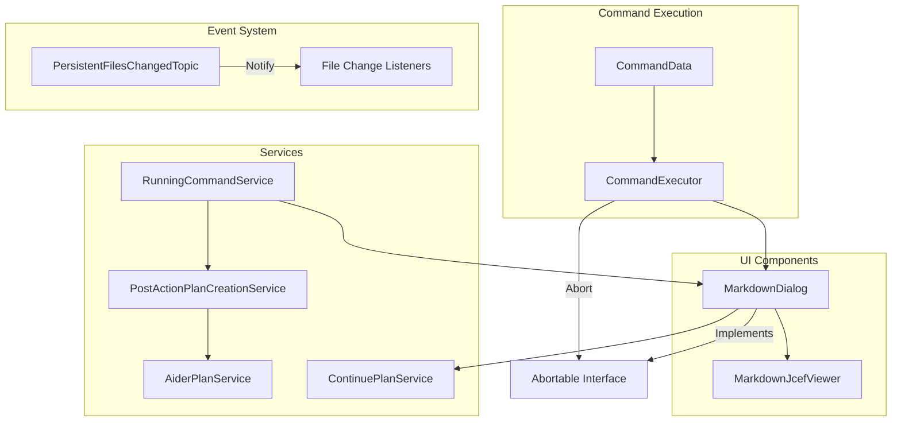

# CodingAider Plugin Documentation

## Overview
The CodingAider plugin provides an integrated development environment for AI-assisted coding within IntelliJ IDEA. It implements a modular architecture with event-driven communication to enable seamless interaction between components. The plugin supports various features including command execution, plan creation, and interactive markdown display.

## Key Modules and Components

### Messages Module
- **File**: [`PersistentFilesChangedTopic.kt`](./PersistentFilesChangedTopic.kt)
- **Purpose**: Defines a contract for handling persistent file change events
- **Key Interface**: `PersistentFilesChangedTopic`
  - Provides the `onPersistentFilesChanged()` method triggered when persistent files are modified
  - Enables components to react to file modifications through a publish-subscribe pattern

### Command Execution
- **File**: [`CommandData.kt`](../command/CommandData.kt)
- **Purpose**: Represents the data required to execute an Aider command
- **Key Classes**:
  - `CommandData`: Contains command parameters including message, files, and options
  - `CommandOptions`: Configures optional behavior like Docker usage and presentation settings
  - `FileData`: Represents a file to be included in the command
  - `ChainedAiderCommand`: Supports multi-step command execution with output transformation

### Services
- **File**: [`RunningCommandService.kt`](../services/RunningCommandService.kt)
- **Purpose**: Manages running commands and stores information about completed commands
- **Key Features**:
  - Tracks active command dialogs
  - Stores last command output and commit hashes
  - Facilitates plan creation from completed commands

- **File**: [`PostActionPlanCreationService.kt`](../services/PostActionPlanCreationService.kt)
- **Purpose**: Creates structured plans from completed Aider commands
- **Key Methods**:
  - `createPlanFromCommand()`: Converts command output into a structured plan
  - `extractSummaryFromOutput()`: Parses XML tags to extract structured summaries

### User Interface
- **File**: [`MarkdownDialog.kt`](../outputview/MarkdownDialog.kt)
- **Purpose**: Displays command output in a formatted markdown viewer
- **Key Features**:
  - Real-time content updates with auto-scrolling
  - Auto-close timer with cancellation option
  - Plan creation and continuation buttons
  - Process abortion handling

## Design Patterns
- **Observer Pattern**: Used for event-driven communication
- **Publish-Subscribe Pattern**: Decouples event producers from consumers
- **Service Locator Pattern**: Leverages IntelliJ's service architecture
- **Command Pattern**: Encapsulates command execution details
- **Builder Pattern**: Used for constructing complex command objects

## Architecture and Interactions


## Dependencies
- **IntelliJ Platform**
  - `com.intellij.util.messages.Topic`: For event communication
  - `com.intellij.openapi.components.Service`: For service registration
  - `com.intellij.notification`: For user notifications
- **Swing/AWT**: For UI components
- **JCEF**: For markdown rendering

## Usage and Implementation

### Command Execution
```kotlin
// Create command data
val commandData = CommandData(
    message = "Generate a test for this class",
    useYesFlag = true,
    llm = "gpt-4",
    additionalArgs = "",
    files = listOf(FileData("path/to/file.kt", false)),
    lintCmd = "",
    projectPath = project.basePath!!
)

// Execute command
val executor = IDEBasedExecutor(project, commandData)
executor.execute()
```

### Subscribing to File Change Events
```kotlin
// Create a listener
class MyFileChangeListener : PersistentFilesChangedTopic {
    override fun onPersistentFilesChanged() {
        // Handle file changes
    }
}

// Subscribe to events
project.messageBus.connect().subscribe(
    PersistentFilesChangedTopic.PERSISTENT_FILES_CHANGED_TOPIC, 
    MyFileChangeListener()
)
```

### Creating a Plan from Command Output
```kotlin
val planService = project.service<PostActionPlanCreationService>()
planService.createPlanFromCommand(commandData, commandOutput)
```

## Best Practices
- Implement lightweight, non-blocking event handlers
- Use service architecture for component communication
- Ensure thread-safety in UI updates with `invokeLater`
- Properly handle resources with timers and cleanup

## Performance Considerations
- Debounce resize events in UI components
- Optimize markdown rendering for large outputs
- Use efficient file traversal methods
- Implement proper cleanup for timers and resources

## Exceptional Implementation Details
- **Auto-scrolling Logic**: Intelligently tracks user scroll position to decide when to auto-scroll
- **XML Tag Parsing**: Extracts structured information from command outputs
- **Timer Management**: Carefully manages multiple timers for different UI behaviors
- **Thread Safety**: Uses `invokeLater` to ensure UI updates happen on the EDT
- **Plan Continuation**: Supports seamless continuation of structured plans

## Related Files
- [`PersistentFilesChangedTopic.kt`](./PersistentFilesChangedTopic.kt)
- [`CommandData.kt`](../command/CommandData.kt)
- [`RunningCommandService.kt`](../services/RunningCommandService.kt)
- [`PostActionPlanCreationService.kt`](../services/PostActionPlanCreationService.kt)
- [`MarkdownDialog.kt`](../outputview/MarkdownDialog.kt)
- [`Abortable.kt`](../outputview/Abortable.kt)

## Potential Extensions
- Add more granular file change detection
- Implement additional command output formats
- Support for more complex plan structures
- Enhanced markdown rendering capabilities
- Integration with additional AI services
