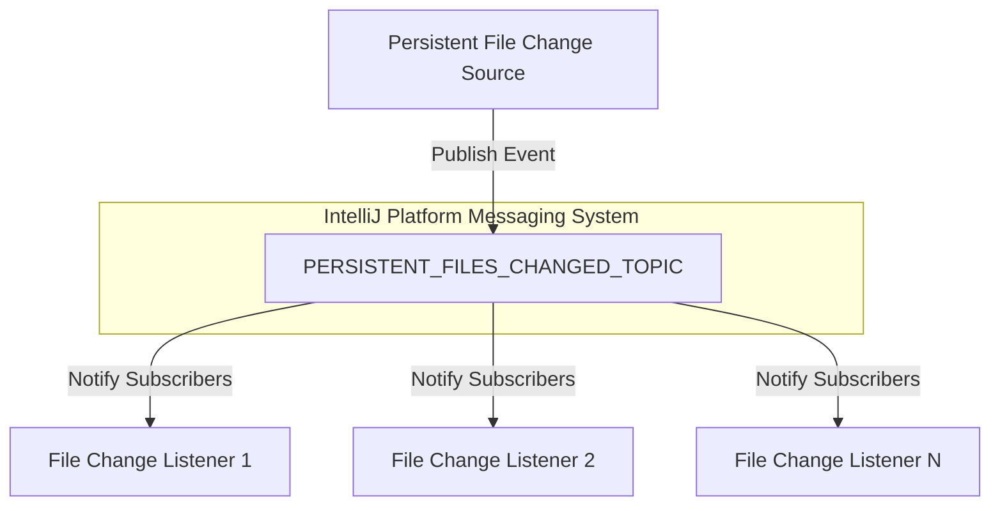

# Messages Module Documentation

## Overview
The Messages module provides a flexible, event-driven mechanism for handling persistent file changes within the IntelliJ Platform plugin. It implements a publish-subscribe pattern to enable loose coupling between components that need to react to file modifications.

## Key Components

### Interface: PersistentFilesChangedTopic
- **File**: [`PersistentFilesChangedTopic.kt`](./PersistentFilesChangedTopic.kt)
- **Purpose**: Define a contract for handling persistent file change events
- **Key Method**: `onPersistentFilesChanged()`
  - Triggered when persistent files are modified
  - Allows components to define custom behavior in response to file changes

### Companion Object
- **PERSISTENT_FILES_CHANGED_TOPIC**
  - Static topic reference for publishing and subscribing to file change events
  - Uses IntelliJ Platform's `Topic.create()` method with unique identifier "Persistent Files Changed"

## Design Patterns
- **Observer Pattern**: Enables event-driven communication
- **Publish-Subscribe Pattern**: Decouples event producers from event consumers

## Architecture and Interaction


## Dependencies
- **IntelliJ Platform**
  - `com.intellij.util.messages.Topic`
  - Provides robust event communication infrastructure

## Usage and Implementation

### Creating a Listener
```kotlin
class MyFileChangeListener : PersistentFilesChangedTopic {
    override fun onPersistentFilesChanged() {
        // Custom logic when files are modified
        // Examples:
        // - Refresh UI components
        // - Trigger background tasks
        // - Log file change events
    }
}
```

### Subscribing to Events
```kotlin
// Typical subscription in a project component
project.messageBus.connect().subscribe(
    PersistentFilesChangedTopic.PERSISTENT_FILES_CHANGED_TOPIC, 
    myFileChangeListener
)
```

## Best Practices
- Implement lightweight, non-blocking event handlers
- Minimize side effects in `onPersistentFilesChanged()`
- Use for notifications, not for heavy file processing
- Ensure thread-safety in event handlers

## Performance Considerations
- Low-overhead event notification mechanism
- Designed for efficient, decoupled communication
- Minimal performance impact on file change detection

## Exceptional Implementation Details
- Uses IntelliJ Platform's type-safe messaging system
- Supports multiple subscribers for a single event
- Provides a centralized mechanism for file change notifications

## Related Files
- [`PersistentFilesChangedTopic.kt`](./PersistentFilesChangedTopic.kt)

## Potential Extensions
- Add logging for file change events
- Implement more granular change detection
- Support conditional file change handling
