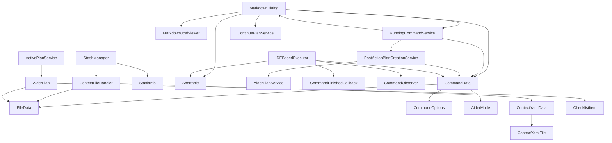

# Coding Aider Model Documentation

This document provides an overview of the core model components and services used in the Coding Aider plugin.

## Overview

The Coding Aider plugin consists of several interconnected components that handle different aspects of the application:

- **Command Data Model**: Defines the structure for commands sent to the Aider backend
- **Context Management**: Handles file context for Aider commands
- **Stash Management**: Provides functionality to save and restore file contexts
- **UI Components**: Dialog components for displaying markdown content and command output
- **Services**: Various services for managing running commands and post-action operations

## Key Components

### Command Data Model

The [CommandData](../command/CommandData.kt) class represents the data required to execute an Aider command:

- Contains message content, model selection, and file context
- Supports different modes (normal, shell, structured)
- Includes options for customizing command execution behavior

Key classes:
- `CommandData`: Main data structure for Aider commands
- `CommandOptions`: Optional parameters for command execution
- `FileData`: Represents a file included in the command context
- `ChainedAiderCommand`: Supports multi-step command chains

### Context Management

The [ContextModel](./ContextModel.kt) provides functionality for reading and writing context files:

- Handles YAML-based context file format
- Supports relative and absolute file paths
- Manages read-only flags for context files

Key components:
- `ContextYamlFile`: Represents a file entry in a context YAML file
- `ContextYamlData`: Container for file entries in a context file
- `ContextFileHandler`: Utility for reading/writing context files

### Stash Management

The [StashModel](./StashModel.kt) provides functionality for managing saved file contexts:

- Supports naming and timestamping of stashed contexts
- Handles file operations for stash files
- Provides display formatting for stash entries

Key components:
- `StashInfo`: Contains metadata about a stashed context
- `StashManager`: Utility for finding and parsing stash files

### UI Components

The [MarkdownDialog](../outputview/MarkdownDialog.kt) provides a rich UI for displaying command output:

- Renders markdown content in a dialog
- Supports auto-scrolling and auto-closing
- Provides buttons for aborting commands and creating plans

Key features:
- Markdown rendering with JCEF
- Auto-scroll behavior with user override
- Auto-close timer with cancellation option
- Plan creation and continuation integration

### Services

#### Running Command Service

The [RunningCommandService](../services/RunningCommandService.kt) manages active and completed commands:

- Tracks currently running command dialogs
- Stores information about the last completed command
- Provides functionality to create plans from completed commands

#### Post Action Plan Creation

The [PostActionPlanCreationService](../services/PostActionPlanCreationService.kt) handles plan creation after command execution:

- Creates structured plans from command output
- Extracts summaries from command output
- Handles error notification for plan creation failures

## Class Dependencies



## Implementation Details

### Stash Naming and File Format

Stash files follow a specific naming convention:
- Format: `.aider.stash.[name].yaml`
- Timestamp format in filenames: `yyyyMMdd_HHmmss`
- Stash files are stored in the project root directory

### Context File Format

Context files use YAML format with the following structure:
```yaml
files:
  - path: relative/path/to/file.kt
    readOnly: false
  - path: another/file.kt
    readOnly: true
```

### MarkdownDialog Auto-Scroll Behavior

The MarkdownDialog implements a smart auto-scroll behavior:
- Auto-scrolls to the bottom when new content is added
- Detects when the user manually scrolls away from the bottom
- Respects user scroll position when they've moved away from the bottom
- Resumes auto-scrolling if the user manually scrolls back to the bottom

### Plan Creation from Command Output

The PostActionPlanCreationService extracts structured information from command output:
- Looks for XML tags like `<aider-intention>` and `<aider-summary>`
- Falls back to using truncated raw output if structured data isn't available
- Creates a new structured plan command with the extracted information
