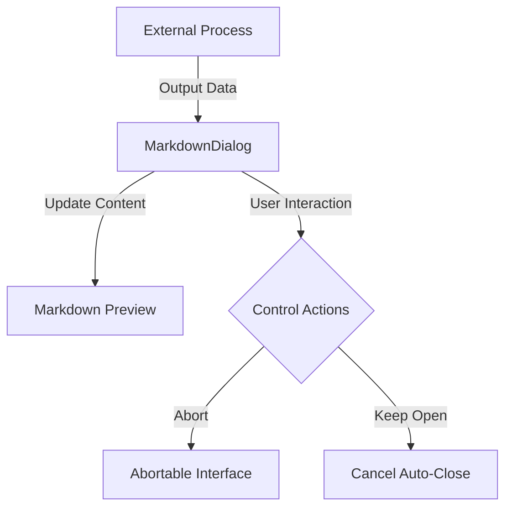

# Output View Module Documentation

## Overview
The Output View module is a critical component of the Coding Aider plugin, responsible for displaying output in a user-friendly, interactive markdown-based dialog within the IntelliJ IDEA environment. It provides flexible mechanisms for presenting dynamic content, handling long-running processes, and offering user interaction controls.

## System Architecture

### Key Components
1. **[Abortable.kt](Abortable.kt)**: Defines an interface for command abortion
2. **[MarkdownDialog.kt](MarkdownDialog.kt)**: Primary dialog implementation for markdown content display
3. **[MarkdownPreviewFileEditorUtil.kt](MarkdownPreviewFileEditorUtil.kt)**: Utility for creating markdown preview editors

### Data Flow Diagram


## Key Interfaces and Classes

### Abortable Interface
- **Location**: [Abortable.kt](Abortable.kt)
- **Purpose**: Provides a standardized mechanism for aborting long-running commands
- **Method**: 
  ```kotlin
  fun abortCommand()
  ```

### MarkdownDialog Class
- **Location**: [MarkdownDialog.kt](MarkdownDialog.kt)
- **Responsibilities**:
  - Display markdown content dynamically
  - Manage dialog lifecycle
  - Provide user interaction controls
- **Key Methods**:
  - `updateProgress(output: String, message: String)`
  - `startAutoCloseTimer(autocloseDelay: Int)`
  - `setProcessFinished()`
  - `focus(delay: Long = 100)`

### MarkdownPreviewFileEditorUtil
- **Location**: [MarkdownPreviewFileEditorUtil.kt](MarkdownPreviewFileEditorUtil.kt)
- **Purpose**: Dynamically create markdown preview editors across different plugin API versions

## Design Patterns
- **Observer Pattern**: Implemented via `Abortable` interface
- **Utility Pattern**: Demonstrated in `MarkdownPreviewFileEditorUtil`
- **Facade Pattern**: `MarkdownDialog` provides a simplified interface for complex UI interactions

## Exceptional Implementation Details

### Thread Safety
- Uses `invokeLater` and `ApplicationManager.getApplication().invokeLater` to ensure thread-safe UI updates
- Leverages Swing's Event Dispatch Thread (EDT) for all UI modifications

### Dynamic Constructor Resolution
- `MarkdownPreviewFileEditorUtil` dynamically finds appropriate constructors for `MarkdownPreviewFileEditor`
- Supports multiple versions of the Markdown plugin by introspecting available constructors

### Configurable User Experience
- Provides auto-close functionality with user-configurable settings
- Offers a "Keep Open" button to interrupt automatic closing
- Supports custom abort mechanisms through the `Abortable` interface

## Dependencies
- IntelliJ Platform SDK
- Markdown Plugin
- Kotlin Standard Library
- Swing UI Toolkit

## Configuration and Extensibility
- Configurable via `AiderSettings`
- Easily extendable through the `Abortable` interface
- Supports dynamic content updates during long-running processes

## Performance Considerations
- Uses lightweight `LightVirtualFile` for markdown rendering
- Implements periodic UI refresh to ensure responsiveness
- Minimizes blocking operations through asynchronous updates

