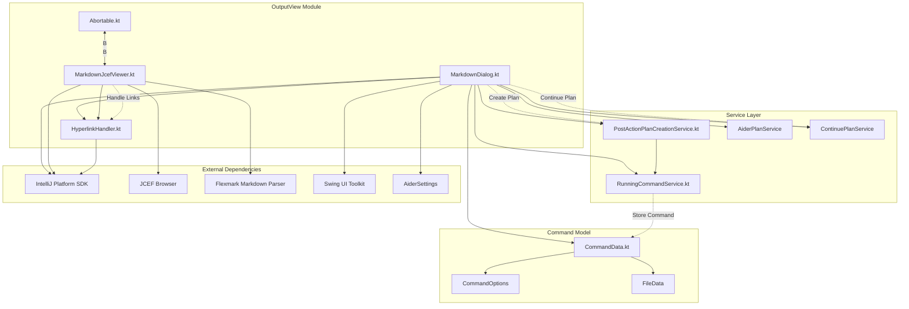

# Output View Module Documentation

## Overview
The Output View module is a critical component of the Coding Aider plugin, responsible for displaying output in a user-friendly, interactive markdown-based dialog within the IntelliJ IDEA environment. It provides flexible mechanisms for presenting dynamic content, handling long-running processes, and offering user interaction controls such as hyperlink navigation, collapsible sections, and auto-scrolling.

## System Architecture

### Key Components
1. **[Abortable.kt](./Abortable.kt)**: Defines an interface for command abortion with plan ID support
2. **[MarkdownDialog.kt](./MarkdownDialog.kt)**: Primary dialog implementation for markdown content display
3. **[MarkdownJcefViewer.kt](./MarkdownJcefViewer.kt)**: Modern JCEF-based markdown renderer with fallback support
4. **[HyperlinkHandler.kt](./HyperlinkHandler.kt)**: Handles hyperlink events in the markdown content
5. **[PostActionPlanCreationService.kt](../services/PostActionPlanCreationService.kt)**: Service for creating plans from completed commands
6. **[RunningCommandService.kt](../services/RunningCommandService.kt)**: Manages running command instances and their state

### Project Dependencies and Interactions


## Key Interfaces and Classes

### Abortable Interface
- **Location**: [./Abortable.kt](./Abortable.kt)
- **Purpose**: Provides a standardized mechanism for aborting long-running commands
- **Interface Definition**:
  ```kotlin
  interface Abortable {
      fun abortCommand(planId: String?)
  }
  ```
- **Usage**: Allows external processes to implement custom abortion logic for long-running tasks, with optional plan ID support

### MarkdownDialog Class
- **Location**: [./MarkdownDialog.kt](./MarkdownDialog.kt)
- **Responsibilities**:
  - Display markdown content dynamically
  - Manage dialog lifecycle
  - Provide user interaction controls
  - Support plan creation and continuation
- **Key Methods**:
  - `updateProgress(output: String, message: String)`: Update dialog content and title
  - `startAutoCloseTimer(autocloseDelay: Int)`: Implement auto-close functionality
  - `setProcessFinished()`: Mark process completion and update UI controls
  - `focus(delay: Long = 100)`: Bring dialog to front
- **Exceptional Features**:
  - Thread-safe UI updates using `invokeLater`
  - Smart auto-scrolling that respects user scroll position
  - Plan creation and continuation integration
  - Debounced resize handling

### MarkdownJcefViewer Class
- **Location**: [./MarkdownJcefViewer.kt](./MarkdownJcefViewer.kt)
- **Purpose**: Provides a modern, feature-rich markdown rendering component
- **Key Features**:
  - JCEF (Chromium Embedded Framework) based rendering
  - Fallback to JEditorPane when JCEF is unavailable
  - Collapsible panels for structured content
  - Search/Replace block formatting
  - Dark/light theme support
  - Special formatting for Aider-specific blocks
- **Key Methods**:
  - `setMarkdown(markdown: String)`: Renders markdown content
  - `setDarkTheme(dark: Boolean)`: Toggles between dark and light themes
  - `convertMarkdownToHtml(markdown: String)`: Transforms markdown to styled HTML

### HyperlinkHandler Class
- **Location**: [./HyperlinkHandler.kt](./HyperlinkHandler.kt)
- **Purpose**: Handles hyperlink navigation in markdown content
- **Key Features**:
  - Supports absolute and relative file paths
  - Opens files in IDE editor
  - Handles HTTP/HTTPS URLs
  - Supports lookup paths for relative file resolution
- **Key Methods**:
  - `handleHyperlinkEvent(event: HyperlinkEvent)`: Processes hyperlink clicks
  - `openFileInIde(filePath: String, project: Project?)`: Opens files in the IDE

### PostActionPlanCreationService
- **Location**: [../services/PostActionPlanCreationService.kt](../services/PostActionPlanCreationService.kt)
- **Purpose**: Creates structured plans from completed command outputs
- **Key Methods**:
  - `createPlanFromCommand(commandData: CommandData, commandOutput: String)`: Generates a plan
  - `extractSummaryFromOutput(output: String)`: Extracts structured summary from command output

### RunningCommandService
- **Location**: [../services/RunningCommandService.kt](../services/RunningCommandService.kt)
- **Purpose**: Manages running command instances and their state
- **Key Features**:
  - Tracks active command dialogs
  - Stores last completed command and output
  - Facilitates plan creation from previous commands
  - Tracks Git commit hashes for comparison
- **Key Methods**:
  - `storeCompletedCommand(commandData: CommandData?, output: String?)`: Stores command results
  - `createPlanFromLastCommand(project: Project)`: Initiates plan creation

## Design Patterns and Principles

### Observer Pattern
- Implemented via `Abortable` interface
- Allows command executors to be notified of abort requests
- Decouples UI from command execution logic

### Facade Pattern
- `MarkdownDialog` provides a simplified interface for complex UI interactions
- Hides implementation details of markdown rendering and dialog management

### Strategy Pattern
- Different rendering strategies in `MarkdownJcefViewer` (JCEF vs JEditorPane)
- Seamless fallback mechanism when preferred strategy is unavailable

### Service Locator Pattern
- Uses IntelliJ's service architecture to locate and use services
- `project.service<ServiceType>()` pattern for service discovery

### Dependency Injection
- Constructor-based injection for required dependencies
- Supports flexible configuration and testing

## Exceptional Implementation Details

### Smart Auto-Scrolling
The `MarkdownDialog` implements a sophisticated auto-scrolling mechanism that:
- Tracks user scroll position to determine auto-scroll behavior
- Automatically scrolls to bottom for new content if user was already at bottom
- Respects user's scroll position when they manually scroll away from bottom
- Uses flags to prevent feedback loops during programmatic scrolling

### JCEF Integration with Fallback
The `MarkdownJcefViewer` provides a robust rendering solution that:
- Prefers JCEF (Chromium Embedded Framework) for modern rendering capabilities
- Automatically falls back to JEditorPane when JCEF is unavailable
- Maintains consistent API regardless of underlying implementation
- Handles JavaScript execution for dynamic content updates

### Collapsible Panel Implementation
The markdown viewer implements collapsible panels that:
- Persist panel state during content updates
- Use JavaScript for smooth animations and state management
- Support nested collapsible sections
- Provide visual indicators for expanded/collapsed state

### Search/Replace Block Formatting
Special formatting for search/replace blocks that:
- Visually distinguishes search and replace sections
- Uses color coding for better readability
- Supports syntax highlighting
- Preserves whitespace and formatting

## Configuration and Extensibility
- Configurable via `AiderSettings`
- Supports custom abort mechanisms
- Dynamic content updates during processes
- Theme-aware rendering that adapts to IDE theme changes
- Configurable auto-close behavior

## Dependencies
- IntelliJ Platform SDK
- JCEF (JetBrains Chromium Embedded Framework)
- Flexmark Markdown Parser
- Kotlin Standard Library
- Swing UI Toolkit

## Error Handling and Logging
- Graceful error handling in UI updates
- Fallback mechanisms for critical features
- Detailed error reporting to console
- Non-blocking UI operations to prevent freezing

## Future Improvements
- Enhanced logging mechanism
- More granular configuration options
- Additional markdown rendering features
- Performance optimizations for large documents
- Improved accessibility features

