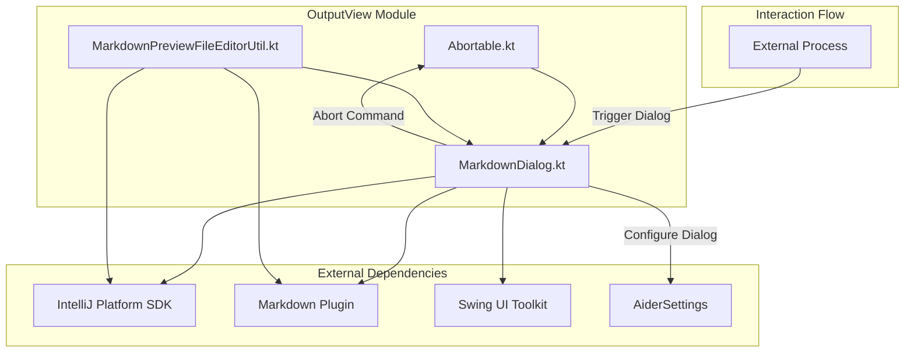

# Output View Module Documentation

## Overview
The Output View module is a critical component of the Coding Aider plugin, responsible for displaying output in a user-friendly, interactive markdown-based dialog within the IntelliJ IDEA environment. It provides flexible mechanisms for presenting dynamic content, handling long-running processes, and offering user interaction controls.

## System Architecture

### Key Components
1. **[Abortable.kt](./Abortable.kt)**: Defines an interface for command abortion
2. **[MarkdownDialog.kt](./MarkdownDialog.kt)**: Primary dialog implementation for markdown content display
3. **[MarkdownPreviewFileEditorUtil.kt](./MarkdownPreviewFileEditorUtil.kt)**: Utility for creating markdown preview editors

### Project Dependencies and Interactions


## Key Interfaces and Classes

### Abortable Interface
- **Location**: [./Abortable.kt](./Abortable.kt)
- **Purpose**: Provides a standardized mechanism for aborting long-running commands
- **Interface Definition**:
  ```kotlin
  interface Abortable {
      fun abortCommand()
  }
  ```
- **Usage**: Allows external processes to implement custom abortion logic for long-running tasks

### MarkdownDialog Class
- **Location**: [./MarkdownDialog.kt](./MarkdownDialog.kt)
- **Responsibilities**:
  - Display markdown content dynamically
  - Manage dialog lifecycle
  - Provide user interaction controls
- **Key Methods**:
  - `updateProgress(output: String, message: String)`: Update dialog content and title
  - `startAutoCloseTimer(autocloseDelay: Int)`: Implement auto-close functionality
  - `setProcessFinished()`: Mark process completion
  - `focus(delay: Long = 100)`: Bring dialog to front
- **Exceptional Features**:
  - Thread-safe UI updates using `invokeLater`
  - Dynamic content refresh
  - Configurable auto-close behavior

### MarkdownPreviewFileEditorUtil
- **Location**: [./MarkdownPreviewFileEditorUtil.kt](./MarkdownPreviewFileEditorUtil.kt)
- **Purpose**: Dynamically create markdown preview editors across different plugin API versions
- **Key Method**: `createMarkdownPreviewEditor()`
  - Supports multiple constructor signatures
  - Dynamically resolves appropriate constructor based on available Markdown plugin version

## Design Patterns and Principles
- **Observer Pattern**: Implemented via `Abortable` interface
- **Utility Pattern**: Demonstrated in `MarkdownPreviewFileEditorUtil`
- **Facade Pattern**: `MarkdownDialog` provides a simplified interface for complex UI interactions
- **Dependency Injection**: Supports flexible configuration through constructor parameters

## Exceptional Implementation Details

### Dynamic Constructor Resolution
- Introspects `MarkdownPreviewFileEditor` constructors
- Supports multiple Markdown plugin versions
- Fallback mechanism for constructor selection

### Thread Safety and Performance
- Uses Swing's Event Dispatch Thread (EDT)
- Implements non-blocking UI updates
- Periodic refresh to ensure responsiveness
- Lightweight rendering with `LightVirtualFile`

## Configuration and Extensibility
- Configurable via `AiderSettings`
- Supports custom abort mechanisms
- Dynamic content updates during processes

## Dependencies
- IntelliJ Platform SDK
- Markdown Plugin
- Kotlin Standard Library
- Swing UI Toolkit

## Error Handling and Logging
- Graceful error handling in UI updates
- Prints error details to console
- Prevents UI freezing during error scenarios

## Future Improvements
- Enhanced logging mechanism
- More granular configuration options
- Support for additional markdown rendering features

