# Coding Aider Services Documentation

## Overview
The Services module is the core of the Coding Aider IntelliJ IDEA plugin, providing a comprehensive set of services that enable intelligent code interaction, structured planning, file management, and AI-powered assistance. This module implements the business logic for AI-assisted coding, plan management, file tracking, and command execution, forming the backbone of the plugin's functionality.

## Module Architecture

### Service Dependencies

```mermaid
graph TD
    %% Plan Management
    AiderPlanService[AiderPlanService] --> AiderPlanPromptService[AiderPlanPromptService]
    ActivePlanService[ActivePlanService] --> AiderPlanService
    ActivePlanService --> FileDataCollectionService
    ContinuePlanService[ContinuePlanService] --> ActivePlanService
    
    %% Command Execution
    CommandSummaryService[CommandSummaryService] --> AiderPlanPromptService
    RunningCommandService[RunningCommandService] --> PostActionPlanCreationService
    PostActionPlanCreationService[PostActionPlanCreationService] --> IDEBasedExecutor[IDEBasedExecutor]
    
    %% File Management
    PersistentFileService[PersistentFileService] --> AiderIgnoreService
    FileDataCollectionService[FileDataCollectionService] --> PersistentFileService
    FileDataCollectionService --> DocumentationFinderService
    FileDataCollectionService --> AiderIgnoreService
    FileExtractorService[FileExtractorService] --> CommandData[CommandData]
    
    %% Sidecar Process
    SidecarProcessInitializer[SidecarProcessInitializer] --> AiderProcessManager
    AiderProcessManager[AiderProcessManager] --> CommandData
    
    %% Edit Services
    PluginBasedEditsService[PluginBasedEditsService] --> SearchReplaceBlockParser[SearchReplaceBlockParser]
    PluginBasedEditsService --> AutoCommitService
    ClipboardEditService[ClipboardEditService] --> SearchReplaceBlockParser
    AutoCommitService[AutoCommitService] --> CommitMessageExtractorService
    
    %% UI and State
    MarkdownDialog[MarkdownDialog] --> RunningCommandService
    MarkdownDialog --> ContinuePlanService
    AiderDialogStateService[AiderDialogStateService] --> CommandData
    
    %% Utility Services
    TokenCountService[TokenCountService] --> CommandData
    AiderHistoryService[AiderHistoryService] --> CommandData
    MarkdownConversionService[MarkdownConversionService] --> CommandData
    ChainCommandService[ChainCommandService] --> IDEBasedExecutor
    AiderPromptAugmentationService[AiderPromptAugmentationService] --> CommandData
    
    %% External Dependencies
    CommandData --> FileData[FileData]
    SearchReplaceBlockParser --> LocalFileSystem[LocalFileSystem]
    AutoCommitService --> Git[Git]
```

## Core Service Groups

### 1. Plan Management Services
These services handle the creation, tracking, and execution of structured coding plans.

#### [AiderPlanService](plans/AiderPlanService.kt)
- **Purpose**: Central service for managing structured coding plans
- **Key Features**:
  - Parses and processes plan files with checklist items
  - Manages plan hierarchies with parent-child relationships
  - Processes markdown references and subplan links
- **Exceptional Implementation**:
  - Custom markdown parsing for checklist extraction
  - Recursive processing of nested plan references
  - Hierarchical plan representation with depth tracking

#### [ActivePlanService](plans/ActivePlanService.kt)
- **Purpose**: Manages the currently active plan being executed
- **Key Features**:
  - Tracks plan execution state
  - Handles plan continuation and completion
  - Manages plan hierarchy navigation
- **Exceptional Implementation**:
  - Automatic cleanup of completed plans
  - Intelligent selection of next plans in hierarchy
  - Robust error handling during plan execution

#### [ContinuePlanService](plans/ContinuePlanService.kt)
- **Purpose**: Provides functionality to continue plan execution
- **Key Features**:
  - Simplified interface for plan continuation
  - Integrates with ActivePlanService

#### [AiderPlanPromptService](plans/AiderPlanPromptService.kt)
- **Purpose**: Generates prompts for plan creation and refinement
- **Key Features**:
  - Creates system prompts for plan creation
  - Filters plan-relevant files
  - Provides guidance for plan structure
- **Exceptional Implementation**:
  - Dynamic prompt generation based on existing plans
  - Structured mode message formatting

### 2. Command Execution Services
These services handle the execution of AI commands and processing of their results.

#### [CommandSummaryService](CommandSummaryService.kt)
- **Purpose**: Generates summaries for executed commands
- **Key Features**:
  - Creates concise summaries based on command mode
  - Supports different AI modes (architect, structured, shell, normal)
- **Exceptional Implementation**:
  - Intelligent message abbreviation
  - Plan-aware summary generation

#### [RunningCommandService](RunningCommandService.kt)
- **Purpose**: Tracks and manages running commands
- **Key Features**:
  - Maintains list of active command dialogs
  - Stores completed command data for reference
  - Facilitates plan creation from completed commands
- **Exceptional Implementation**:
  - Tracks Git commit hashes before and after commands
  - Integrates with PostActionPlanCreationService

#### [PostActionPlanCreationService](PostActionPlanCreationService.kt)
- **Purpose**: Creates plans from completed command outputs
- **Key Features**:
  - Extracts summaries from command outputs
  - Generates plan creation commands
- **Exceptional Implementation**:
  - XML tag-based summary extraction
  - Intelligent prompt construction for plan creation

### 3. File Management Services
These services handle file tracking, collection, and persistence.

#### [PersistentFileService](PersistentFileService.kt)
- **Purpose**: Manages persistent file context across sessions
- **Key Features**:
  - YAML-based file tracking
  - File stashing and unstashing
  - File validity checking
- **Exceptional Implementation**:
  - Thread-safe file operations
  - Background validation of file existence
  - Integration with message bus for change notifications

#### [FileDataCollectionService](FileDataCollectionService.kt)
- **Purpose**: Collects files for AI context
- **Key Features**:
  - Traverses file hierarchies
  - Filters ignored files
  - Integrates with documentation finder
- **Exceptional Implementation**:
  - Path normalization for cross-platform compatibility
  - Distinct file collection to avoid duplicates

#### [AiderIgnoreService](AiderIgnoreService.kt)
- **Purpose**: Manages file ignore patterns
- **Key Features**:
  - Parses .aiderignore files
  - Converts patterns to glob matchers
  - Checks if files should be ignored
- **Exceptional Implementation**:
  - Efficient pattern caching
  - Support for various ignore pattern formats
  - Dynamic reload of ignore patterns

#### [FileExtractorService](FileExtractorService.kt)
- **Purpose**: Extracts files from archives
- **Key Features**:
  - JAR file extraction
  - Temporary file management
- **Exceptional Implementation**:
  - Path-aware extraction
  - Parent directory creation

#### [DocumentationFinderService](DocumentationFinderService.kt)
- **Purpose**: Discovers relevant documentation files
- **Key Features**:
  - Recursively finds markdown documentation
  - Filters documentation by extension
- **Exceptional Implementation**:
  - Directory hierarchy traversal
  - Plan-aware documentation filtering

### 4. Sidecar Process Services
These services manage the sidecar process for AI command execution.

#### [AiderProcessManager](sidecar/AiderProcessManager.kt)
- **Purpose**: Manages AI sidecar processes
- **Key Features**:
  - Process lifecycle management
  - Command sending and response handling
  - Multi-process support for plans
- **Exceptional Implementation**:
  - Reactive process communication with Flux/Mono
  - Robust process cleanup
  - Intelligent output parsing with prompt detection

#### [SidecarProcessInitializer](sidecar/SidecarProcessInitializer.kt)
- **Purpose**: Initializes sidecar processes
- **Key Features**:
  - Settings-aware process initialization
  - Plan-specific process creation
- **Exceptional Implementation**:
  - Settings change listener
  - Coroutine-based initialization

### 5. Edit Services
These services handle code edits and Git integration.

#### [PluginBasedEditsService](PluginBasedEditsService.kt)
- **Purpose**: Processes AI-generated code edits
- **Key Features**:
  - Parses and applies edit blocks
  - Generates edit summaries
  - Integrates with auto-commit
- **Exceptional Implementation**:
  - File system synchronization
  - Detailed change reporting

#### [ClipboardEditService](ClipboardEditService.kt)
- **Purpose**: Handles clipboard-based code edits
- **Key Features**:
  - Processes text with edit blocks
  - Tracks modified files
- **Exceptional Implementation**:
  - Delegates to SearchReplaceBlockParser

#### [AutoCommitService](AutoCommitService.kt)
- **Purpose**: Automatically commits code changes
- **Key Features**:
  - Settings-aware commit behavior
  - Commit message extraction
  - Git integration
- **Exceptional Implementation**:
  - Repository state validation
  - Notification system integration
  - Support for dirty commits

#### [CommitMessageExtractorService](CommitMessageExtractorService.kt)
- **Purpose**: Extracts commit messages from AI responses
- **Key Features**:
  - XML tag-based message extraction
  - Logging of extracted messages

### 6. UI and State Services
These services manage UI components and application state.

#### [MarkdownDialog](../outputview/MarkdownDialog.kt)
- **Purpose**: Displays AI responses in markdown format
- **Key Features**:
  - Markdown rendering
  - Auto-scroll management
  - Process abort handling
- **Exceptional Implementation**:
  - Debounced resize handling
  - Auto-close timer
  - Plan continuation integration

#### [AiderDialogStateService](AiderDialogStateService.kt)
- **Purpose**: Maintains dialog state
- **Key Features**:
  - Stores dialog configuration
  - Preserves state between sessions
- **Exceptional Implementation**:
  - Immutable state representation

### 7. Utility Services
These services provide various utility functions.

#### [TokenCountService](TokenCountService.kt)
- **Purpose**: Counts tokens for AI interactions
- **Key Features**:
  - Text and file token counting
  - Model-specific encoding
- **Exceptional Implementation**:
  - JTokkit integration
  - File size and type filtering

#### [AiderHistoryService](AiderHistoryService.kt)
- **Purpose**: Manages command history
- **Key Features**:
  - Parses input and chat history
  - Extracts XML-tagged prompts
- **Exceptional Implementation**:
  - Multiple timestamp format support
  - Structured output cleaning

#### [MarkdownConversionService](MarkdownConversionService.kt)
- **Purpose**: Converts HTML to markdown
- **Key Features**:
  - HTML cleaning and sanitization
  - Markdown conversion
- **Exceptional Implementation**:
  - JSoup integration for HTML processing
  - Flexmark for markdown conversion

#### [ChainCommandService](ChainCommandService.kt)
- **Purpose**: Executes chains of commands
- **Key Features**:
  - Sequential command execution
  - Output transformation between steps
- **Exceptional Implementation**:
  - Flexible command chaining

#### [AiderPromptAugmentationService](AiderOutputSummaryService.kt)
- **Purpose**: Augments prompts with system instructions
- **Key Features**:
  - XML-tagged prompt formatting
  - Commit message block inclusion
- **Exceptional Implementation**:
  - Slash command handling
  - Configurable augmentation

#### [ExampleChainCommand](ExampleChainCommand.kt)
- **Purpose**: Example implementation of command chaining
- **Key Features**:
  - Dialog-based prompt collection
  - Command execution and summarization

#### [AiderEditFormat](AiderEditFormat.kt)
- **Purpose**: Defines edit format options
- **Key Features**:
  - Enumeration of supported edit formats

#### [AiderDocsService](AiderDocsService.kt)
- **Purpose**: Manages documentation folder
- **Key Features**:
  - Defines documentation folder constant

## Data Models

### [CommandData](../command/CommandData.kt)
- **Purpose**: Core data model for command execution
- **Key Features**:
  - Comprehensive command configuration
  - File list management
  - Mode tracking
- **Exceptional Implementation**:
  - Immutable data representation
  - Flexible options system

## Design Patterns
- **Service Pattern**: All components are implemented as services with clear responsibilities
- **Dependency Injection**: Services are injected via IntelliJ's service mechanism
- **Observer Pattern**: Used for file change notifications and settings changes
- **Command Pattern**: Used for executing AI commands
- **Strategy Pattern**: Different execution strategies for different modes
- **Builder Pattern**: Used for constructing complex prompts
- **Reactive Pattern**: Used in process management with Flux/Mono

## External Dependencies
- **IntelliJ Platform SDK**: Core platform integration
- **Jackson**: YAML processing for context files
- **JTokkit**: Token counting for AI models
- **JSoup**: HTML processing for markdown conversion
- **Flexmark**: Markdown parsing and rendering
- **Project Reactor**: Reactive programming for process management
- **Git4Idea**: Git integration for auto-commits

## Exceptional Features
1. **Plan Hierarchy Management**: Sophisticated system for managing nested plans with parent-child relationships
2. **Reactive Process Communication**: Advanced use of Project Reactor for asynchronous process management
3. **Intelligent File Tracking**: Thread-safe file validation with background processing
4. **XML-Tagged Response Parsing**: Structured extraction of intentions, summaries, and commit messages
5. **Auto-Scroll Management**: Smart detection of user scrolling to control auto-scroll behavior
6. **Multi-Process Support**: Concurrent AI processes for different plans
7. **Path Normalization**: Cross-platform path handling for consistent file references
