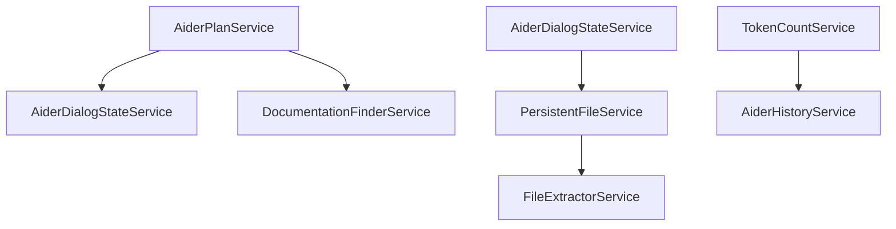

# Aider Services Documentation

## Overview
The Aider Services module provides a comprehensive set of services for the Coding Aider IntelliJ IDEA plugin, facilitating intelligent code interaction, file management, and project documentation. This module supports advanced features like token counting, persistent file tracking, dialog state management, and dynamic documentation discovery.

## Module Architecture

### Service Dependencies

## Key Services

### 1. AiderPlanService
- **Purpose**: Manages structured coding plans and checklists
- **Key Features**:
  - Generates system prompts for feature implementation
  - Supports structured mode for plan tracking
  - Creates plan and checklist markdown files
- **Exceptional Implementation**:
  - Uses custom markers for plan identification
  - Dynamically adapts prompts based on existing plans

### 2. TokenCountService
- **Purpose**: Precise token counting for AI interactions
- **Key Features**:
  - Uses `jtokkit` for accurate token estimation
  - Supports multiple encoding models
  - Can count tokens in text and files
- **Exceptional Implementation**:
  - Configurable encoding registry
  - Robust error handling during token counting

### 3. PersistentFileService
- **Purpose**: Manages file context across plugin sessions
- **Key Features**:
  - YAML-based persistent file tracking
  - Supports read-only and editable file states
  - Provides file change notifications
- **Exceptional Implementation**:
  - Uses Jackson for YAML processing
  - Integrates with IntelliJ's `LocalFileSystem`
  - Implements a message bus for file change events

### 4. DocumentationFinderService
- **Purpose**: Intelligent documentation discovery
- **Key Features**:
  - Recursively finds markdown documentation
  - Supports project-wide documentation context
- **Exceptional Implementation**:
  - Traverses directory hierarchy
  - Filters documentation files dynamically

### 5. AiderDialogStateService
- **Purpose**: Maintains conversation and interaction state
- **Key Features**:
  - Stores comprehensive dialog metadata
  - Supports mode tracking (shell, structured)
- **Exceptional Implementation**:
  - Immutable state representation
  - Project-scoped state management

### 6. AiderHistoryService
- **Purpose**: Tracks user interactions and chat history
- **Key Features**:
  - Persistent input and chat history
  - Structured mode aware history parsing
- **Exceptional Implementation**:
  - Custom timestamp parsing
  - Structured mode input extraction

### 7. MarkdownConversionService
- **Purpose**: Converts HTML content to clean Markdown format
- **Key Features**:
  - HTML cleaning and sanitization
  - Intelligent noise removal
  - Configurable markdown conversion
- **Exceptional Implementation**:
  - Uses JSoup for HTML processing
  - Flexmark for markdown conversion
  - Extensible conversion options

### 8. FileExtractorService
- **Purpose**: Handles file extraction from various sources
- **Key Features**:
  - JAR file content extraction
  - Temporary file management
- **Exceptional Implementation**:
  - Dynamic file path handling
  - Supports extraction from compressed archives

## Design Patterns
- **Singleton Pattern**: All services use IntelliJ's service mechanism
- **Dependency Injection**: Project-scoped service instantiation
- **Immutable State**: Dialog state representation

## External Dependencies
- IntelliJ Platform SDK
- Jackson (YAML processing)
- JTokkit (Token counting)

## File References
- [AiderPlanService.kt](./AiderPlanService.kt)
- [TokenCountService.kt](./TokenCountService.kt)
- [PersistentFileService.kt](./PersistentFileService.kt)
- [DocumentationFinderService.kt](./DocumentationFinderService.kt)
- [AiderDialogStateService.kt](./AiderDialogStateService.kt)
- [AiderHistoryService.kt](./AiderHistoryService.kt)
- [FileExtractorService.kt](./FileExtractorService.kt)
