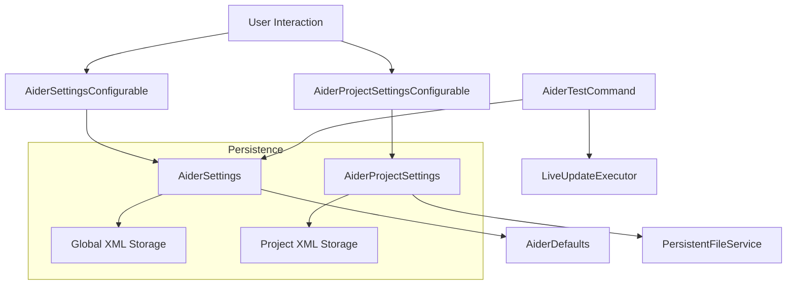

# Aider Settings Module Documentation

## Overview
The Aider Settings module provides a comprehensive configuration management system for the Aider IDE plugin, enabling flexible and persistent settings across application and project levels, including support for custom LLM providers.

## Module Structure

### Key Components
- [AiderDefaults.kt](./AiderDefaults.kt): Central repository for default configuration values
- [AiderSettings.kt](./AiderSettings.kt): Application-wide persistent settings management
- [AiderProjectSettings.kt](./AiderProjectSettings.kt): Project-specific persistent settings
- [AiderSettingsConfigurable.kt](./AiderSettingsConfigurable.kt): Global settings UI configuration
- [AiderProjectSettingsConfigurable.kt](./AiderProjectSettingsConfigurable.kt): Project-level settings UI configuration
- [AiderTestCommand.kt](./AiderTestCommand.kt): Utility for testing Aider command execution
- [CustomLlmProvider.kt](./CustomLlmProvider.kt): Custom LLM provider configuration
- [CustomLlmProviderService.kt](./CustomLlmProviderService.kt): Service managing custom LLM providers

## Design Patterns and Architectural Principles
- **Singleton Pattern**: Ensures single, consistent settings instances
- **Persistent State Management**: Leverages IntelliJ Platform's `PersistentStateComponent`
- **Separation of Concerns**: Distinct classes for defaults, global, and project-level settings
- **Dependency Injection**: Uses IntelliJ Platform's service locator pattern
- **Observer Pattern**: Implemented in command execution and settings management
- **Factory Pattern**: Used in custom LLM provider creation and management
- **Strategy Pattern**: Applied for different LLM provider types (OpenAI, Ollama, OpenRouter)

## Module Responsibilities

### [AiderDefaults.kt](./AiderDefaults.kt)
- Defines default configuration values for the entire Aider plugin
- Provides centralized constant management
- Ensures consistent default behavior across the application

### [CustomLlmProvider.kt](./CustomLlmProvider.kt)
- Defines the data structure for custom LLM providers
- Supports multiple provider types (OpenAI, Ollama, OpenRouter)
- Handles provider-specific configuration requirements

### [CustomLlmProviderService.kt](./CustomLlmProviderService.kt)
- Manages persistence of custom LLM providers
- Handles provider lifecycle (add, remove, update)
- Provides centralized access to provider configurations

### [AiderSettings.kt](./AiderSettings.kt)
- Application-level persistent settings management
- Implements `PersistentStateComponent` for XML-based state persistence
- Supports dynamic configuration of global plugin settings
- Manages complex settings like auto-commits and Docker integration

### [AiderProjectSettings.kt](./AiderProjectSettings.kt)
- Project-specific persistent settings management
- Tracks project-level file configurations
- Supports read-only file management
- Enables project-specific customizations

### [AiderSettingsConfigurable.kt](./AiderSettingsConfigurable.kt)
- Provides comprehensive UI for global plugin settings
- Implements dynamic API key management
- Supports complex configuration scenarios
- Offers tooltips and validation for settings

### [AiderProjectSettingsConfigurable.kt](./AiderProjectSettingsConfigurable.kt)
- Manages project-level file persistence
- Enables adding, removing, and toggling file read-only status
- Provides intuitive file management interface

### [AiderTestCommand.kt](./AiderTestCommand.kt)
- Validates Aider installation and configuration
- Supports Docker and native execution testing
- Provides feedback on command execution

## Data Flow and Interaction Diagram

## Exceptional Implementation Details
- Dynamic API key validation with visual indicators
- Flexible Docker image and tag configuration
- Comprehensive settings persistence across IDE sessions
- Advanced file management with read-only support
- Experimental features with cautionary tooltips
- Integrated command testing mechanism

## Security Considerations
- Secure API key storage
- Configurable key visibility
- Environment and file-based key support
- Masked API key display
- Controlled API key management
- Provider-specific API key handling
- Secure storage of custom provider credentials

## Performance Optimization
- Minimal overhead for settings management
- Lazy loading of configuration components
- Efficient state serialization
- Non-blocking UI interactions

## Extensibility
- Modular design allows easy addition of configuration options
- Supports extending existing classes
- Flexible default value management

## Dependencies
- IntelliJ Platform SDK
- Swing UI components
- Custom command execution framework
- Java Swing for UI components

## Usage and Integration Guidelines
1. Configure global settings via IDE preferences
2. Override project-specific settings when needed
3. Use test command to validate configuration
4. Refer to tooltips for detailed option explanations

## Contribution Guidelines
When adding new settings:
- Update `AiderDefaults`
- Modify `AiderSettings.State`
- Extend `AiderSettingsConfigurable`
- Ensure backward compatibility
- Add comprehensive documentation
- Implement thorough testing

## Licensing and Attribution
- Part of the Aider IDE Plugin
- Open-source contribution welcome
- Follows IntelliJ Platform SDK guidelines

