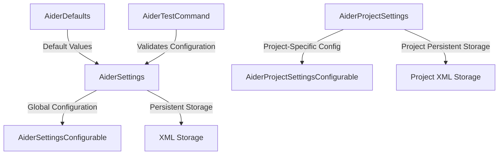

# Aider Settings Module Documentation

## Overview
The Aider Settings module provides a comprehensive configuration management system for the Aider IDE plugin, enabling flexible and persistent settings across application and project levels.

## Module Structure

### Key Components
- [AiderDefaults.kt](./AiderDefaults.kt): Central repository for default configuration values
- [AiderSettings.kt](./AiderSettings.kt): Application-wide persistent settings management
- [AiderProjectSettings.kt](./AiderProjectSettings.kt): Project-specific persistent settings
- [AiderSettingsConfigurable.kt](./AiderSettingsConfigurable.kt): Global settings UI configuration
- [AiderProjectSettingsConfigurable.kt](./AiderProjectSettingsConfigurable.kt): Project-level settings UI configuration
- [AiderTestCommand.kt](./AiderTestCommand.kt): Utility for testing Aider command execution

## Design Patterns and Architectural Principles
- **Singleton Pattern**: Ensures single, consistent settings instances
- **Persistent State Management**: Leverages IntelliJ Platform's `PersistentStateComponent`
- **Separation of Concerns**: Distinct classes for defaults, global, and project-level settings

## Data Flow Diagram

## Key Configuration Areas
1. **LLM and API Settings**
   - Model selection
   - API key management
   - Default language models

2. **Execution Modes**
   - Docker integration
   - Shell mode
   - Structured editing

3. **Git and Version Control**
   - Commit strategies
   - Comparison tools
   - Change context inclusion

4. **Advanced Settings**
   - Logging verbosity
   - Dialog behaviors
   - Markdown processing

## Exceptional Implementation Details
- Dynamic API key validation with visual indicators
- Flexible Docker image and tag configuration
- Experimental features with cautionary tooltips
- Comprehensive settings persistence across IDE sessions

## Dependencies
- IntelliJ Platform SDK
- Swing UI components
- Custom command execution framework

## Extensibility
The modular design allows easy addition of new configuration options by extending existing classes and updating default values.

## Security Considerations
- Secure API key storage
- Configurable key visibility
- Environment and file-based key support

## Performance Notes
- Minimal overhead for settings management
- Lazy loading of configuration components
- Efficient state serialization

## Future Improvements
- Enhanced LLM model support
- More granular configuration options
- Improved error handling and validation

## Usage Guidelines
1. Configure global settings via IDE preferences
2. Override project-specific settings when needed
3. Use test command to validate configuration
4. Refer to tooltips for detailed option explanations

## Contribution
When adding new settings:
- Update `AiderDefaults`
- Modify `AiderSettings.State`
- Extend `AiderSettingsConfigurable`
- Ensure backward compatibility

