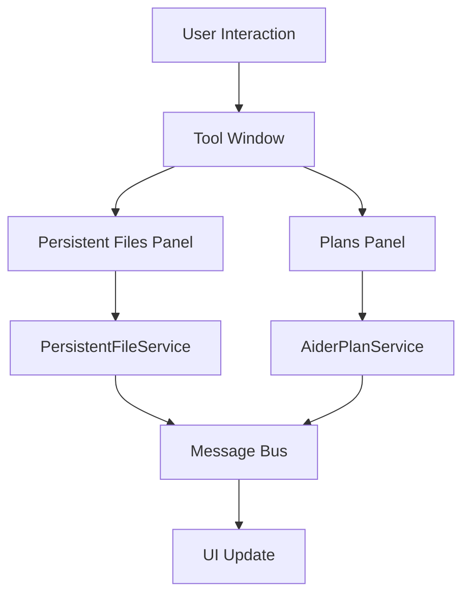

# Coding Aider Tool Window

## Overview
The Coding Aider Tool Window is a specialized interface in the Coding Aider application that provides two main panels:
1. Persistent Files Panel - For managing frequently accessed files
2. Plans Panel - For viewing and executing Aider plans

## Architecture and Design

### Key Components
- **CodingAiderToolWindow**: Main tool window factory implementation
- **CodingAiderToolWindowContent**: Content manager for both panels
- **PersistentFilesPanel**: Manages persistent file list
- **PlansPanel**: Handles plan display and execution
- **PlanViewer**: Renders and manages plan interactions

### Design Patterns
- **Observer Pattern**: Uses IntelliJ Platform's message bus for real-time updates
- **Component-Based Design**: Separates UI and business logic
- **Factory Pattern**: Tool window creation

### Class Responsibilities

#### CodingAiderToolWindow
- Implements `ToolWindowFactory`
- Creates and initializes tool window content
- **Key Method**: `createToolWindowContent(project: Project, toolWindow: ToolWindow)`

#### PersistentFilesPanel
Manages persistent files functionality:
- File list management
- Read-only mode toggling
- Batch file operations
- Real-time file list updates

**Key Features**:
- Add individual files or directories
- Add currently open files
- Toggle read-only status
- Remove selected files
- Double-click to open files

#### PlansPanel & PlanViewer
Handles Aider plans:
- Displays plan list with completion status
- Shows checklist progress
- Enables plan continuation
- Provides plan details on hover

**Key Features**:
- Visual progress indicators
- Plan execution controls
- Double-click to open plan files
- Real-time plan updates

### Data Flow

### Implementation Details
- File system change monitoring
- Plan completion tracking
- Keyboard shortcuts support
- Customizable UI components

### Dependencies
- IntelliJ Platform SDK
- Kotlin Stdlib
- Custom services:
  - PersistentFileService
  - AiderPlanService

### Usage Scenarios
1. Managing reference files across sessions
2. Tracking and executing multi-step plans
3. Monitoring plan progress
4. Quick access to relevant project files

## Configuration
The tool window is configurable through:
- IntelliJ IDE settings
- Coding Aider plugin settings

## Related Documentation
- [FileData](../command/FileData.kt)
- [AiderPlan](../services/AiderPlanService.kt)
- [PersistentFileService](../services/PersistentFileService.kt)
