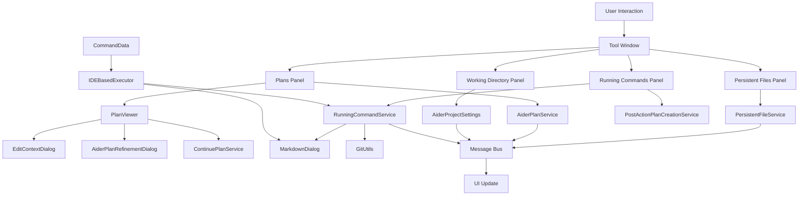

# Coding Aider Tool Window

## Overview

The Coding Aider Tool Window is a specialized interface in the IntelliJ IDEA plugin that provides four main panels for enhancing AI-assisted development:

1. **Persistent Files Panel** - For managing frequently accessed files across sessions
2. **Plans Panel** - For viewing, executing, and refining structured AI plans
3. **Working Directory Panel** - For restricting Aider operations to a specific directory
4. **Running Commands Panel** - For monitoring and managing active Aider commands

## Architecture and Design

### Key Components

- **[CodingAiderToolWindow](CodingAiderToolWindow.kt)**: Main tool window factory implementation
- **[CodingAiderToolWindowContent](CodingAiderToolWindow.kt)**: Content manager for all panels
- **[PersistentFilesPanel](persistentfiles/PersistentFilesPanel.kt)**: Manages persistent file list with stashing capabilities
- **[PlansPanel](plans/PlansPanel.kt)**: Handles plan display and execution
- **[PlanViewer](plans/PlanViewer.kt)**: Renders and manages plan interactions with hierarchical visualization
- **[WorkingDirectoryPanel](workingdirectory/WorkingDirectoryPanel.kt)**: Controls directory-scoped operations
- **[RunningCommandsPanel](runningcommands/RunningCommandsPanel.kt)**: Monitors running commands with action controls

### Design Patterns

- **Observer Pattern**: Uses IntelliJ Platform's message bus for real-time updates across components
- **Component-Based Design**: Separates UI and business logic with clear responsibilities
- **Factory Pattern**: Tool window creation and component initialization
- **Command Pattern**: Encapsulates command execution and state management
- **Composite Pattern**: Hierarchical plan representation and management

### Class Responsibilities

#### [CodingAiderToolWindow](CodingAiderToolWindow.kt)

- Implements `ToolWindowFactory` to integrate with IntelliJ's tool window system
- Creates and initializes tool window content with collapsible panels
- **Key Method**: `createToolWindowContent(project: Project, toolWindow: ToolWindow)`

#### [PersistentFilesPanel](persistentfiles/PersistentFilesPanel.kt)

Manages persistent files functionality with advanced features:

- File list management with read-only toggles
- Stash management for temporary file collections
- Real-time file list updates via message bus
- File operations with visual feedback

**Key Features**:

- Add individual files or directories with filtering
- Add currently open editor files
- Toggle read-only status for reference files
- Stash/unstash file collections for later use
- Double-click to open files in editor
- Keyboard shortcuts for common operations

#### [PlansPanel](plans/PlansPanel.kt) & [PlanViewer](plans/PlanViewer.kt)

Handles Aider plans with hierarchical visualization:

- Displays plan list with tree structure and completion status
- Shows checklist progress with visual indicators
- Enables plan continuation, refinement, and context editing
- Provides animated tree expansion/collapse

**Key Features**:

- Visual progress indicators with completion tracking
- Plan execution and refinement controls
- Hierarchical plan visualization with parent/child relationships
- Context file management via [EditContextDialog](plans/EditContextDialog.kt)
- Plan refinement via [AiderPlanRefinementDialog](plans/AiderPlanRefinementDialog.kt)
- Double-click to open plan files
- Real-time plan updates with file system monitoring

#### [WorkingDirectoryPanel](workingdirectory/WorkingDirectoryPanel.kt)

Manages working directory configuration:

- Directory selection within project boundaries
- Path validation and normalization
- Clear/reset functionality
- Project-relative path handling

**Key Features**:

- Visual directory path display with tooltips
- Directory selection via file chooser
- Working directory persistence via project settings
- Path validation with error handling

#### [RunningCommandsPanel](runningcommands/RunningCommandsPanel.kt)

Monitors running commands with action capabilities:

- Displays a list of currently running commands
- Provides actions for command results and plan creation
- Enables Git diff visualization for command changes
- Double-click to focus on a running command

**Key Features**:

- Show last command result
- Create structured plan from last command
- Show Git diff for Aider changes
- Real-time command monitoring

### Dialog Components

#### [MarkdownDialog](../outputview/MarkdownDialog.kt)

Displays command output with rich markdown rendering:

- Renders markdown content with syntax highlighting
- Supports auto-scrolling with user override
- Provides command abort/continue functionality
- Auto-close with configurable timer

**Key Features**:

- Rich markdown rendering via JCef browser
- Auto-scrolling with smart detection
- Command abort handling
- Plan continuation integration
- Auto-close with keep-open option

#### [EditContextDialog](plans/EditContextDialog.kt)

Manages context files for plans:

- Displays and edits plan context files
- Supports adding files from multiple sources
- Toggles read-only status
- Persists changes to YAML configuration

#### [AiderPlanRefinementDialog](plans/AiderPlanRefinementDialog.kt)

Enables plan refinement:

- Displays current plan content
- Accepts refinement instructions
- Integrates with plan service for updates

### Service Integration

#### [PostActionPlanCreationService](../services/PostActionPlanCreationService.kt)

Handles plan creation from command outputs:

- Extracts relevant information from command output
- Creates structured plans from completed commands
- Handles error notification and recovery

#### [RunningCommandService](../services/RunningCommandService.kt)

Manages running command state:

- Tracks active and completed commands
- Stores command output for later use
- Provides Git commit hash tracking for diffs
- Enables plan creation from command history

### Data Flow

### Implementation Details

- **Animated Tree Expansion**: The plan viewer implements smooth animations for tree expansion/collapse
- **Stash Management**: The persistent files panel includes a stash system for temporary file collections
- **Smart Auto-Scrolling**: The markdown dialog detects user scroll position to intelligently manage auto-scroll
- **Plan Hierarchy**: Plans support parent-child relationships with proper visualization
- **File System Monitoring**: Components subscribe to file system changes for real-time updates
- **Context-Aware Actions**: Actions are enabled/disabled based on current selection and state

### Dependencies

- **IntelliJ Platform SDK**: For UI components and integration
- **JCef Browser**: For markdown rendering
- **Jackson**: For YAML processing of context files
- **Git Integration**: For diff visualization and commit tracking
- **Custom Services**:
  - [PersistentFileService](../services/PersistentFileService.kt): File persistence
  - [AiderPlanService](../services/plans/AiderPlanService.kt): Plan management
  - [ContinuePlanService](../services/plans/ContinuePlanService.kt): Plan continuation
  - [RunningCommandService](../services/RunningCommandService.kt): Command tracking
  - [PostActionPlanCreationService](../services/PostActionPlanCreationService.kt): Plan creation
  - [AiderProjectSettings](../settings/AiderProjectSettings.kt): Project-level settings

## Usage Scenarios

1. **Reference File Management**: Maintain collections of frequently accessed files across sessions
2. **File Stashing**: Temporarily store file collections for different tasks
3. **Structured Plan Execution**: Track and execute multi-step AI-generated plans
4. **Plan Refinement**: Iteratively improve plans based on feedback
5. **Scoped Operations**: Restrict AI operations to specific project directories
6. **Command Monitoring**: Track running commands and their status
7. **Post-Command Planning**: Convert ad-hoc commands into structured plans
8. **Git Change Visualization**: Review changes made by AI commands

## Configuration

The tool window is configurable through:

- **IntelliJ IDE Settings**: Tool window placement and visibility
- **Coding Aider Plugin Settings**: AI model selection, behavior options
- **Project Settings**: Working directory, test configurations

## Related Documentation

- [AiderPlanService](../services/plans/AiderPlanService.kt): Plan management service
- [PersistentFileService](../services/PersistentFileService.kt): File persistence service
- [RunningCommandService](../services/RunningCommandService.kt): Command tracking service
- [CommandData](../command/CommandData.kt): Command data structure
- [MarkdownJcefViewer](../outputview/MarkdownJcefViewer.kt): Markdown rendering component
