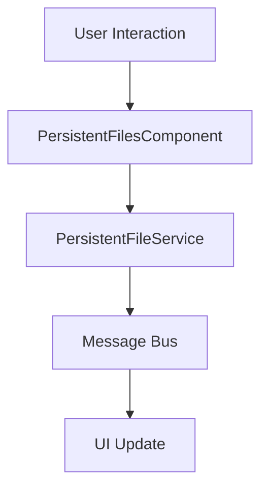

# Persistent Files Tool Window

## Overview
The Persistent Files Tool Window is a specialized module in the Coding Aider application designed to provide users with a comprehensive file management interface. It enables developers to maintain a persistent list of files across IDE sessions, with advanced features like read-only toggling and batch file management.

## Architecture and Design

### Key Components
- **[PersistentFilesToolWindow.kt](./CodingAiderToolWindow.kt)**: Primary implementation of the tool window
- **PersistentFileService**: Backend service for managing persistent file data
- **FileData**: Data model representing file metadata

### Design Patterns
- **Observer Pattern**: Utilizes IntelliJ Platform's message bus for real-time UI updates
- **Component-Based Design**: Separates UI rendering and file management logic

### Class Responsibilities

#### PersistentFilesToolWindow
- Implements `ToolWindowFactory`
- Creates the tool window content
- **Key Method**: `createToolWindowContent(project: Project, toolWindow: ToolWindow)`

#### PersistentFilesComponent
Manages the core functionality of file persistence:
- File list management
- User interaction handling
- Integration with `PersistentFileService`

**Key Methods**:
- `addPersistentFiles()`: File selection and addition
- `toggleReadOnlyMode()`: Read-only status management
- `removeSelectedFiles()`: Batch file removal
- `loadPersistentFiles()`: Synchronizes UI with persistent file list

#### PersistentFileRenderer
- Custom list cell renderer
- Displays file paths with read-only status

### Data Flow Diagram

### Exceptional Implementation Details
- Supports both individual file and directory selection
- Provides keyboard (Delete key) and double-click file opening
- Real-time UI updates via message bus subscription

### Dependencies
- IntelliJ Platform SDK
- Kotlin Stdlib
- Custom `PersistentFileService`

### Usage Scenarios
1. Maintaining a list of frequently accessed files
2. Marking files as read-only for reference
3. Persistent file tracking across IDE sessions

## Configuration and Extensibility
The module is designed to be easily extensible and configurable within the Coding Aider ecosystem.

## Related Documentation
- [FileData Documentation](../command/FileData.kt)
- [PersistentFileService Documentation](../services/PersistentFileService.kt)
