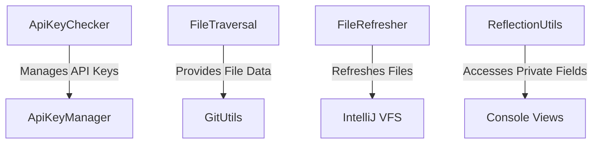

# Coding Aider Utils Module

## Overview
The Coding Aider Utils module is a comprehensive utility package designed to support the Coding Aider application's core functionalities. It provides a robust set of tools for file management, Git interactions, API key handling, and reflection-based operations within the IntelliJ IDEA plugin ecosystem.

## Module Architecture

### Architectural Diagram

## Key Components

### 1. File Management
#### `FileTraversal`
- **Purpose**: Recursively traverse files and directories
- **Key Methods**:
  - `traverseFilesOrDirectories()`: Generates a list of `FileData` from given virtual files
- **Exceptional Behavior**: Handles both files and nested directories efficiently

#### `FileRefresher`
- **Purpose**: Synchronize file system changes in IntelliJ's Virtual File System
- **Key Methods**:
  - `refreshFiles()`: Refreshes files and optionally displays a markdown dialog
- **Thread Safety**: Uses `ApplicationManager` and `WriteAction` for safe UI interactions

### 2. Version Control
#### `GitUtils`
- **Purpose**: Provide Git repository interaction utilities
- **Key Methods**:
  - `getCurrentCommitHash()`: Retrieve current Git commit hash
  - `openGitComparisonTool()`: Open diff viewer for specific commits
- **Exceptional Handling**: Gracefully manages scenarios with no active Git repository

### 3. API Key Management
#### `ApiKeyChecker` & `DefaultApiKeyChecker`
- **Purpose**: Secure API key retrieval and validation
- **Key Features**:
  - Multi-source API key lookup (Credential Store, Environment Variables, .env files)
  - Support for multiple LLM providers
- **Supported LLMs**:
  - Anthropic (Sonnet, Haiku)
  - OpenAI (GPT-4o, Mini)
  - DeepSeek

#### `ApiKeyManager`
- **Purpose**: Secure credential storage using IntelliJ's `PasswordSafe`
- **Key Methods**:
  - `saveApiKey()`: Securely store API keys
  - `getApiKey()`: Retrieve stored API keys
  - `removeApiKey()`: Delete stored credentials

### 4. Reflection Utilities
#### `ReflectionUtils`
- **Purpose**: Access private fields in IntelliJ console views
- **Key Methods**:
  - `getNodesMapFromBuildView()`: Extract nodes from build console
  - `getTestsMapFromConsoleView()`: Retrieve test information

## Design Patterns
- **Singleton Pattern**: Implemented across utility classes
- **Dependency Injection**: Leverages IntelliJ's service-based architecture
- **Strategy Pattern**: Flexible API key retrieval strategies

## Dependencies
- IntelliJ Platform SDK
- `git4idea` library
- Kotlin Reflection

## Security Considerations
- Credentials stored using IntelliJ's secure `PasswordSafe`
- Multi-source API key retrieval with prioritized lookup
- No plain-text storage of sensitive information

## Performance Notes
- Lazy loading of Git repositories
- Efficient file traversal using Kotlin sequences
- Minimal overhead reflection techniques

## Linked Files
- [FileTraversal.kt](FileTraversal.kt)
- [GitUtils.kt](GitUtils.kt)
- [ApiKeyChecker.kt](ApiKeyChecker.kt)
- [ApiKeyManager.kt](ApiKeyManager.kt)
- [FileRefresher.kt](FileRefresher.kt)
- [ReflectionUtils.kt](ReflectionUtils.kt)
