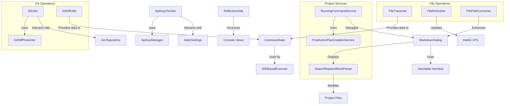

# Coding Aider Utils Module

## Overview
The Coding Aider Utils module provides essential utilities that support the core functionality of the Coding Aider plugin for IntelliJ IDEA. This module contains a collection of specialized tools for file management, Git operations, API key handling, UI components, and reflection-based utilities that enable seamless integration with the IntelliJ platform.

## Module Architecture

### Component Relationships

## Key Components

### 1. File Management

#### [`FileTraversal`](FileTraversal.kt)
- **Purpose**: Recursively traverses file structures to collect file data
- **Key Methods**:
  - `traverseFilesOrDirectories()`: Converts VirtualFiles to FileData objects
  - `normalizedFilePath()`: Standardizes file paths for consistent handling
- **Usage**: Used throughout the application to gather files for processing by Aider

#### [`FileRefresher`](FileRefresher.kt)
- **Purpose**: Ensures the IntelliJ Virtual File System reflects actual file system changes
- **Key Methods**:
  - `refreshFiles()`: Updates VFS and optionally shows a dialog
  - `refreshPath()`: Refreshes a specific directory path
- **Thread Safety**: Uses `invokeLater` and `WriteAction` for thread-safe operations

#### [`FilePathConverter`](FilePathConverter.kt)
- **Purpose**: Converts file paths in text to clickable markdown links
- **Key Methods**:
  - `convertPathsToMarkdownLinks()`: Transforms file paths to markdown links
- **Performance Optimization**: Uses chunked processing for large texts
- **Exceptional Behavior**: Contains commented-out validation code due to performance issues

### 2. Git Integration

#### [`GitUtils`](GitUtils.kt)
- **Purpose**: Provides Git repository interaction utilities
- **Key Methods**:
  - `getCurrentCommitHash()`: Retrieves the current commit hash
  - `openGitComparisonTool()`: Opens the Git diff viewer
- **Performance Note**: Contains a TODO about performance impact on editor

#### [`GitDiffUtils`](GitDiffUtils.kt)
- **Purpose**: Extracts changes between Git commits
- **Key Methods**:
  - `getChangedFiles()`: Returns files changed between two commits
- **Return Type**: Returns a `DiffResult` containing both files and diff content

#### [`GitDiffPresenter`](GitDiffPresenter.kt)
- **Purpose**: Displays Git diffs in the IntelliJ UI
- **Key Methods**:
  - `presentChanges()`: Shows changes using IntelliJ's diff viewer
  - `presentChangesSimple()`: Alternative implementation using SimpleDiffRequest

### 3. API Key Management

#### [`ApiKeyChecker`](ApiKeyChecker.kt) & [`DefaultApiKeyChecker`](ApiKeyChecker.kt)
- **Purpose**: Validates and retrieves API keys for various LLM providers
- **Key Features**:
  - Multi-source API key lookup (Credential Store, Environment Variables, .env files)
  - Caching mechanism to reduce repeated lookups
  - Support for custom LLM providers
- **Supported LLMs**:
  - OpenAI (GPT-4.1, GPT-4o-mini, o1-mini, etc.)
  - Anthropic (Sonnet, Haiku)
  - DeepSeek (Deepseek, r1)
  - Google (Gemini-2.5-pro)

#### [`ApiKeyManager`](ApiKeyManager.kt)
- **Purpose**: Securely stores and retrieves API keys using IntelliJ's PasswordSafe
- **Key Methods**:
  - `saveApiKey()`: Securely stores an API key
  - `getApiKey()`: Retrieves a stored API key
  - `removeApiKey()`: Deletes a stored API key
- **Security**: Uses IntelliJ's built-in credential storage system

### 4. UI Components

#### [`MarkdownDialog`](MarkdownDialog.kt)
- **Purpose**: Displays markdown content in a dialog with progress updates
- **Key Features**:
  - Auto-scrolling with user override detection
  - Auto-close timer with "Keep Open" option
  - Plan creation and continuation buttons
  - Abort functionality for running processes
- **Thread Safety**: Uses `invokeLater` for UI updates

#### [`SearchReplaceBlockParser`](SearchReplaceBlockParser.kt)
- **Purpose**: Parses and applies code edits from LLM responses
- **Key Features**:
  - Support for multiple edit formats (SEARCH/REPLACE blocks, whole file, unified diff)
  - Handles file creation and modification
  - Line ending preservation
- **Exceptional Handling**: Detailed error reporting and notifications

### 5. Services

#### [`RunningCommandService`](RunningCommandService.kt)
- **Purpose**: Tracks and manages running Aider commands
- **Key Methods**:
  - `storeCompletedCommand()`: Stores command data for later use
  - `createPlanFromLastCommand()`: Converts a completed command to a plan
- **State Management**: Maintains references to active dialogs and command history

#### [`PostActionPlanCreationService`](PostActionPlanCreationService.kt)
- **Purpose**: Creates structured plans from completed Aider commands
- **Key Methods**:
  - `createPlanFromCommand()`: Generates a plan based on command output
  - `extractSummaryFromOutput()`: Parses structured output from LLM responses

### 6. Reflection Utilities

#### [`ReflectionUtils`](ReflectionUtils.kt)
- **Purpose**: Provides access to private fields in IntelliJ components
- **Key Methods**:
  - `findMethod()`: Finds and makes accessible a method in a class
  - `getNodesMapFromBuildView()`: Extracts node data from build console
  - `getTestsMapFromConsoleView()`: Retrieves test data from test console
- **Security Note**: Uses reflection to access otherwise inaccessible fields

### 7. Data Models

#### [`CommandData`](CommandData.kt)
- **Purpose**: Represents the data required to execute an Aider command
- **Key Components**:
  - `CommandData`: Core command information
  - `CommandOptions`: Optional parameters
  - `FileData`: File information with path normalization
  - `ChainedAiderCommand`: Support for multi-step command chains

## Design Patterns

- **Service Pattern**: Application and project-level services (`RunningCommandService`, `PostActionPlanCreationService`)
- **Singleton Pattern**: Utility classes with static methods (`ApiKeyManager`, `FileTraversal`)
- **Strategy Pattern**: Interface-based design for API key checking
- **Observer Pattern**: Notification of settings changes
- **Builder Pattern**: Command data construction
- **Facade Pattern**: Simplified interfaces to complex subsystems

## Security Considerations

- **API Key Management**: Secure storage using IntelliJ's PasswordSafe
- **Multi-source Retrieval**: Prioritized lookup from secure to less secure sources
- **Caching**: Time-limited caching to balance performance and security
- **Environment Variables**: Support for standard security practices

## Performance Optimizations

- **Caching**: API key caching to reduce repeated lookups
- **Chunked Processing**: File path conversion in manageable chunks
- **Lazy Initialization**: Deferred loading of expensive resources
- **Thread Management**: Proper use of background threads for I/O operations

## Exception Handling

- **Graceful Degradation**: Fallbacks when primary methods fail
- **User Notifications**: Clear error messages for actionable issues
- **Logging**: Comprehensive logging for debugging
- **Recovery Mechanisms**: Auto-refresh after file system changes

## Dependencies

- **IntelliJ Platform SDK**: Core platform integration
- **git4idea**: Git repository interaction
- **Kotlin Standard Library**: Language features and extensions
- **JCef**: Embedded browser for markdown rendering

## Linked Files

- [ApiKeyChecker.kt](ApiKeyChecker.kt)
- [ApiKeyManager.kt](ApiKeyManager.kt)
- [CommandData.kt](../command/CommandData.kt)
- [FilePathConverter.kt](FilePathConverter.kt)
- [FileRefresher.kt](FileRefresher.kt)
- [FileTraversal.kt](FileTraversal.kt)
- [GitDiffPresenter.kt](GitDiffPresenter.kt)
- [GitDiffUtils.kt](GitDiffUtils.kt)
- [GitUtils.kt](GitUtils.kt)
- [MarkdownDialog.kt](../outputview/MarkdownDialog.kt)
- [PostActionPlanCreationService.kt](../services/PostActionPlanCreationService.kt)
- [ReflectionUtils.kt](ReflectionUtils.kt)
- [RunningCommandService.kt](../services/RunningCommandService.kt)
- [SearchReplaceBlockParser.kt](SearchReplaceBlockParser.kt)
